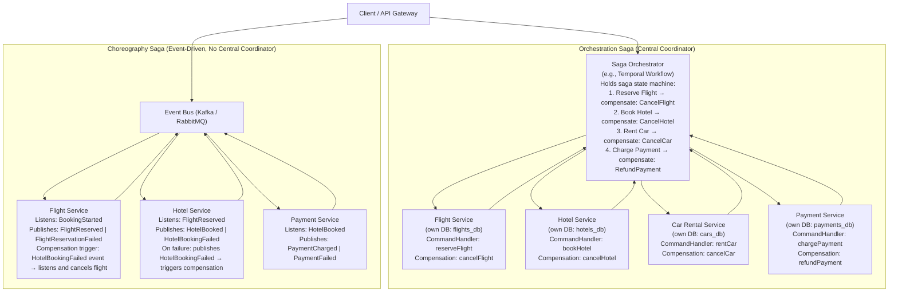
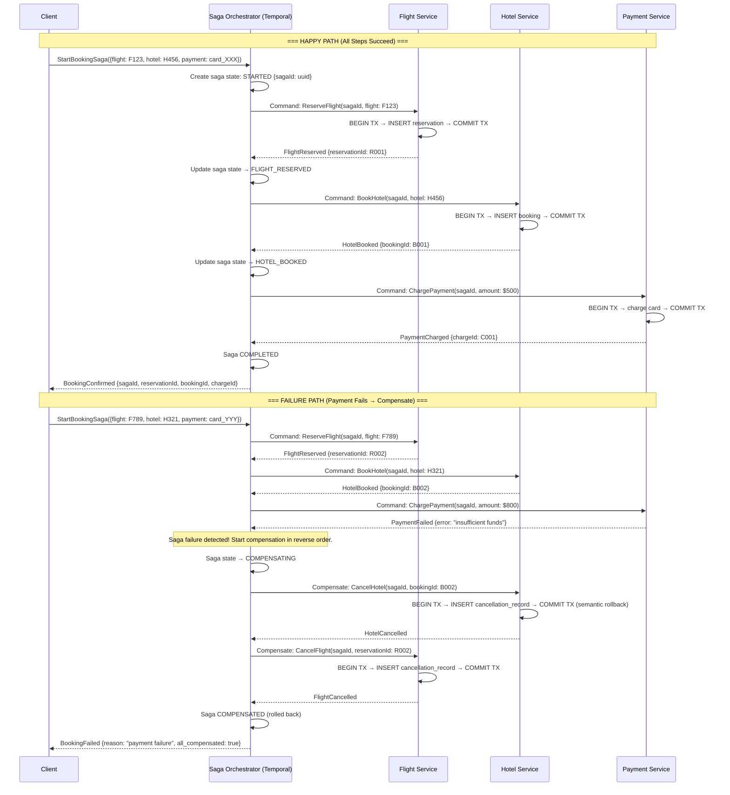
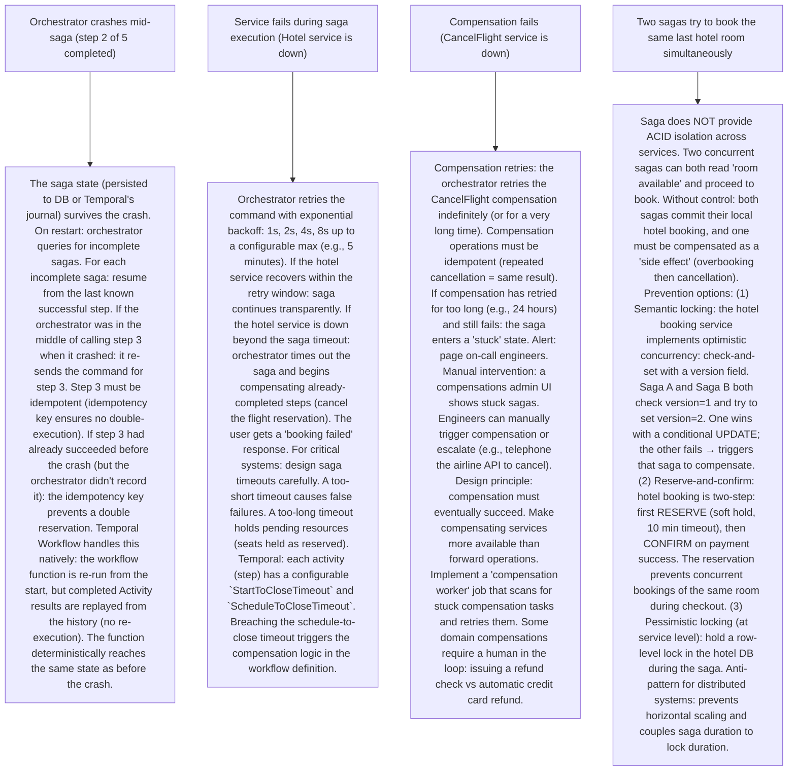

# P3 — Saga Pattern (like Uber Rides, Netflix Checkout, Airbnb Booking)

---

## ELI5 — What Is This?

> Imagine booking a vacation trip: you need to (1) reserve a flight, (2) book a hotel, (3) rent a car.
> If all three succeed — great! Your vacation is booked.
> If step 2 (hotel) fails after you've already reserved the flight — what happens?
> You can't just leave the flight reservation dangling.
> You need to "undo" the flight reservation.
> Traditional databases do this with a single ACID transaction — but only within ONE database on ONE server.
> When your flight, hotel, and car rental live in THREE separate microservices
> (each with their own database): you cannot use a single ACID transaction across all three.
> The Saga Pattern solves this: break the big transaction into a sequence of small,
> local transactions. If any step fails: run compensating transactions to undo all
> previous steps. It's like a chain of "do this, and if anything fails later: undo it."
> Two approaches: Choreography (services talk to each other directly), and Orchestration
> (a central conductor tells each service what to do and handles failures).

---

## Glossary (Every Keyword Explained in ELI5)

| Word | ELI5 Meaning |
|---|---|
| **Saga** | A sequence of local transactions, each in a different service/database, with compensating transactions defined for each step. If a step fails: all previous steps' compensating transactions run to restore consistency. Named after the database paper "Sagas" by Hector Garcia-Molina & Kenneth Salem (1987). |
| **Local Transaction** | A regular, single-service, single-database ACID transaction. A saga is composed of N local transactions. Each local transaction commits independently (not as part of a distributed transaction). |
| **Compensating Transaction** | The "undo" operation for a completed local transaction. Since the local transaction has already committed: you can't rollback (ACID rollback is impossible). Instead you run a new transaction that reverses the business effect (e.g., "cancel flight reservation" compensates "reserve flight"). Compensating transactions must be idempotent (safe to re-execute if the saga infrastructure retries). |
| **Choreography Saga** | Each service publishes events when it completes its step. Other services listen for those events and decide what to do next. No central coordinator. Services communicate via event bus (Kafka, RabbitMQ). Each service knows its own part in the saga and which events to react to. |
| **Orchestration Saga** | A central orchestrator service (Saga Orchestrator or Workflow Engine) tracks the saga state and sends commands to each service. The orchestrator knows the full saga definition. It handles failures: on step N failure, it sends compensating commands to steps N-1, N-2, etc. |
| **Temporal Workflow** | A durable workflow execution engine. Defines saga steps as code (functions). If a step fails: Temporal retries or executes compensation logic. Survives process crashes: state is persisted. Used by Uber, Netflix, Airbnb, Stripe for saga orchestration. |
| **Two-Phase Commit (2PC)** | The traditional distributed transaction protocol (coordinator + participants, prepare + commit). Not a saga. Requires all participants to lock resources during the vote phase (blocking). A coordinator failure leaves participants locked indefinitely. Saga is the alternative to 2PC: no distributed locks, eventual consistency instead of ACID across services. |
| **BASE** | Basically Available, Soft State, Eventually Consistent. Sagas achieve BASE semantics across services — not ACID. During saga execution: system is temporarily inconsistent (flight is booked, hotel booking in-flight). After saga completes (success or full compensation): system is eventually consistent. |
| **Idempotency Key** | A unique ID attached to each saga step operation. If the step is retried (network failure, service restarts): the receiving service recognizes the key and skips re-execution (returns cached result). Ensures at-most-once business effects even with at-least-once messaging. |
| **Semantic Rollback** | A compensating transaction is not a SQL ROLLBACK. It's a new forward transaction that undoes the business effect. "Cancel flight reservation" is a new row in the booking_cancellations table, not a deletion of the original booking row. Audit trail is preserved. This distinction is important for compliance, debugging, and reporting. |

---

## Component Diagram

---

## Step-by-Step Request Flow

---

## Bottlenecks — Every Point Explained

| # | Bottleneck | Why It Hurts | Fix |
|---|---|---|---|
| 1 | **Partial saga execution visible to users** | Between step 2 (hotel booked) and step 3 (payment charged): the booking is "partially complete" in the system. If the user queries "my bookings": they may see a hotel reservation that hasn't been paid for. Data is temporarily inconsistent. This is the fundamental trade-off of SAGA vs ACID: you sacrifice isolation (ACID's I) for availability across services. | "Pending" state management: design your domain model to explicitly represent saga intermediate states. The flight booking has status: `RESERVED` (not `CONFIRMED` until saga completes). The UI shows "booking in progress" or hides the reservation until fully confirmed. Semantic locking: some saga resources are locked at the business level ("seat held for 10 minutes"), not the database level. This prevents other sagas from booking the same seat during execution. |
| 2 | **Compensating transactions can fail** | A compensation is a new transaction. It can fail too. If "CancelFlight" fails (flight service is down): the saga is stuck in a half-compensated state. The flight is still booked but the payment never happened. Data inconsistency persists indefinitely if compensation failures aren't retried. | Idempotent compensation + persistent retry: compensating transactions must be idempotent. The orchestrator retries failed compensations indefinitely until they succeed. In Temporal: compensation activities run with unlimited retries and timeouts. In the extreme case (flight service permanently down): the saga leaves a "dirty read" that must be resolved via manual intervention or a reconciliation process (a batch job that finds uncommitted compensation requests and re-triggers them). |
| 3 | **Orchestrator is a single point of failure** | If the Saga Orchestrator process crashes mid-saga: the saga state must be recoverable. If the orchestrator is stateless (just in-memory): crash = saga stuck forever. This is catastrophic: you have dangling reservations with no compensations scheduled. | Durable saga state: persist saga state to a database (or use Temporal/Cadence which built-in durability). Every state transition is written to DB before executing the next step. On orchestrator restart: scan for incomplete sagas and resume or re-trigger compensation. Temporal's execution model: all workflow state (saga steps completed, outputs, activation timestamps) is stored in a journal (Event History). Workflow code is re-executed from scratch on restart, but the Event History ensures it resumes exactly where it left off without re-running completed steps. |
| 4 | **Choreography: hard to track saga state** | In choreography, no single service knows the full saga state. To answer "what's the status of booking #B123?": you have to reconstruct it from events in the event log across multiple topics. Debugging failures is complex: which service published what event and when? Which service is waiting for what? Without centralized tracking, observability requires replaying all events. | Add a dedicated saga state store (even in choreography): a state-tracking service subscribes to all saga events and maintains an aggregate view per sagaId. You can then query this service for the full saga state. Alternatively: switch to orchestration for complex sagas that have more than 5 steps or complex branching logic. Choreography works well for simple linear 2-3 step sagas. For complex flows: orchestration (Temporal) provides better debuggability via built-in workflow history UI. |
| 5 | **Duplicate messages cause double-compensations** | Message queues (Kafka) guarantee at-least-once delivery. A compensation message for "CancelFlight" may be delivered twice. If the flight service processes it twice: it might double-cancel. Or more critically: if a duplicated "PaymentCharged" event triggers a second hotel booking — the user gets double-charged. | Idempotency keys at every step: each saga command/event carries a unique `idempotencyKey = sagaId + stepName`. The receiver stores processed keys in a deduplication table: `INSERT INTO processed_events (key) ON CONFLICT DO NOTHING`. If the key already exists: skip processing and return the cached result. This ensures exactly-once behavior at the business logic level, even with at-least-once message delivery. Outbox pattern (see P5) ensures events are reliably published exactly once from source services. |

---

## What Happens When Each Part Fails?

---

## Key Numbers to Know

| Metric | Value |
|---|---|
| Temporal workflow history limit | 50K–200K events (configurable, then must continue-as-new) |
| Typical saga timeout (e-commerce checkout) | 30 seconds |
| Typical saga timeout (travel booking) | 5-10 minutes (user holds seat while entering payment) |
| Temporal activity retry default | 3 retries, exponential backoff |
| Uber trips/day processed via Cadence/Temporal | 1M+ per day |
| Saga compensation lag (Kafka at-least-once) | < 100ms message delivery (sub-second compensation trigger) |
| DoorDash order sagas | Each order = 8-12 step saga (verify items, assign driver, payment, etc.) |

---

## How All Components Work Together (The Full Story)

The Saga Pattern exists because **distributed transactions (2PC) don't scale** in microservice architectures.

**Why not 2PC (Two-Phase Commit)?**
2PC coordinates a distributed transaction: every participant locks its resources, votes to commit, and a coordinator tells everyone to commit or rollback simultaneously. Problems at scale: (1) The coordinator is a SPOF. (2) All participants are blocked waiting for the prepare vote — this can take seconds if any participant is slow. Holding locks for seconds in a high-traffic system causes cascading timeouts. (3) Coordinator crashes after sending PREPARE but before COMMIT → all participants stuck with locked resources forever (in-doubt transaction). 2PC works within a single system or between 2-3 known partners. It doesn't work when you have 10+ microservices each owning their own database.

**The Saga solution:**
Instead of one big transaction: decompose into N local transactions. Each local transaction commits immediately (millisecond response). If a later step fails: compensate earlier steps with new compensating transactions. The system achieves **eventual consistency** — not immediate consistency, but guaranteed to converge to a consistent state.

**Choreography vs Orchestration:**
- Choreography: services are autonomous. FlightService knows "when FlightReserved, wait for HotelBooked or listen for HotelFailed." No central brain. Good for simple linear flows. Bad for complex branching or rollback that involves many services (very hard to trace).
- Orchestration: a Saga Orchestrator knows the full workflow: "do A, then B, then C. If B fails: undo A." The orchestrator (Temporal, Axon, AWS Step Functions) persists state at durable storage and resumes on failures. Easier to reason about, debug, and monitor. Recommended for sagas with > 3 steps or complex compensation logic.

> **ELI5 Summary:** Sagas are like a relay race with a safety net. Each runner completes their leg and hands the baton. If runner 3 drops the baton (failure): runners 2 and 1 run back to their starting points (compensations). The race is over but the track is clean. No baton is left orphaned. The orchestrator is the race director with a clipboard watching every runner.

---

## Key Trade-offs

| Decision | Option A | Option B | Why |
|---|---|---|---|
| **Choreography vs Orchestration** | Choreography: no central coordinator, services are autonomous, works in pure event-driven systems. Simple to start. Hard to debug when sagas span 5+ services. No single place to see full saga state. | Orchestration: central workflow engine (Temporal, Step Functions), full state visibility, easier debugging via workflow history UI. Orchestrator can be a bottleneck. Single point of coupling. | **Start with orchestration for non-trivial sagas.** Choreography introduces distributed control flow that's very hard to reason about at scale. Temporal's durable execution model solves orchestrator SPOF. Uber, Netflix, Stripe all use Temporal/Cadence because visibility and debuggability matter more than removing a central coordinator. |
| **Long-running saga (hold resources) vs short saga (release early)** | Long saga: hold the flight reservation until all saga steps complete (payment, hotel, car). User experience of a single atomic operation. But: holds scarce resources (flight seats) for the duration of the saga (potentially 10+ minutes if user is slow). | Short saga: each step is independent. Reserve flight → immediately confirm (don't hold pending payment). No seat blocking. But: if payment fails, must cancel committed booking — more compensations needed. | **Domain dictates:** for limited-availability resources (concert tickets, plane seats, hotel rooms): short saga is better (confirm reservation, compensate if payment fails). Resources are released quickly to other users. For non-scarce resources (posting a tweet, submitting an order): long saga or even synchronous multi-step operations are fine. |
| **Saga timeout (aggressive vs generous)** | Short timeout (30s): user must complete checkout quickly. Compensations trigger fast. Resources not held for long. Bad UX if user is slow or on spotty network. | Long timeout (10 min): user-friendly, time to fix payment issues. Resources held long. Compensation window is wide — if a later step is delayed, earlier resources are reserved unnecessarily. | **Match timeout to user behavior:** payment flows: 5-10 minutes (user might need to find card). Background batch processing sagas: no timeout (run to completion or infinite retry). Use heartbeat timeouts in Temporal: if a worker stops heartbeating (crash), Temporal can trigger compensation immediately rather than waiting for the full timeout. |

---

## Important Cross Questions

**Q1. How is the Saga Pattern different from Two-Phase Commit?**
> 2PC: globally atomic. All participants vote PREPARE (lock resources). Coordinator sends COMMIT to all. If coordinator fails after PREPARE: participants are stuck holding locks indefinitely (in-doubt transaction). Strong consistency but poor availability and scalability. Saga: locally atomic per service. Each step commits immediately (no cross-service lock held). Compensating transactions are used for rollback (semantic rollback ≠ ACID rollback). Saga provides BASE semantics: eventually consistent. No distributed lock held during saga execution → no blocking, scales horizontally. Trade-off: 2PC is safer for financial systems where intermediate states must never be visible. Saga requires careful design of compensations and idempotency. In practice: most microservice architectures prefer Saga because 2PC requires all participants to implement XA protocol (which many databases support poorly or not at all, and adds latency).

**Q2. What makes a compensating transaction different from a simple ROLLBACK?**
> SQL ROLLBACK: available only within a single open transaction. It discards all changes in the current transaction as if they never happened. No trace remains. Compensating transaction in a saga: the original transaction has already COMMITTED. You cannot ROLLBACK it. The compensating transaction creates a new record that semantically reverses the effect. Example: original = `INSERT INTO reservations (flight, status) VALUES ('F123', 'RESERVED')`. Compensation = `UPDATE reservations SET status='CANCELLED' WHERE id=R1` or `INSERT INTO cancellations (reservation_id, reason) VALUES (R1, 'saga_failed')`. The original record still exists in the database. Audit trails, compliance, debugging all benefit from this. The key requirement: compensating transactions MUST be idempotent — if the orchestrator retries the compensation, the end state is the same (no double-cancellation charge, no duplicate refund).

**Q3. How does Temporal guarantee that a workflow resumes exactly where it left off after a crash?**
> Temporal's core mechanism: "durable execution." Every state transition in a workflow (activity started, activity completed, timer fired, signal received) is appended to an immutable Event History log. This log is stored in a fault-tolerant Temporal backend (Cassandra or PostgreSQL). When a worker crashes and reconnects: Temporal re-dispatches the workflow to a new worker. The new worker runs the workflow function from the beginning. But: every time the function calls an Activity or timer: instead of re-executing it, Temporal checks the Event History. If that event was already completed: the result is replayed from history (no re-execution). The workflow code must be deterministic (same inputs → same sequence of calls). Non-determinism (random numbers, current time, UUIDs) must be isolated to Activities (not workflow function directly). This is the "replay-based execution model." It guarantees that a workflow resumes exactly at its last known state even after worker crashes, restarts, or deployments.

**Q4. How does Netflix use the Saga Pattern in its billing system?**
> Netflix processes millions of billing events daily across multiple services. The billing saga roughly involves: (1) AuthorizationService: hold charge on credit card. (2) EntitlementService: grant subscription access. (3) AuditService: record billing event. (4) NotificationService: send receipt email. If EntitlementService fails after the authorization: the saga must release the authorization hold (compensation). Netflix's Conductor (open-source, now Orkes Conductor) is their orchestration engine. Each billing saga is a Conductor workflow definition (JSON DSL): steps, compensations, and retry policies. Conductor persists workflow state in Dynomite (Redis-based). On failure: Conductor auto-retries with backoff. If max retries exceeded: saga enters FAILED state and triggers compensation workflow. Netflix engineers can view all running/failed sagas in the Conductor UI: step-by-step timeline, which activity failed, what the error was. This observability is why Netflix chose orchestration over choreography.

**Q5. What is the "Outbox pattern" and how does it relate to Sagas?**
> The dual-write problem: a saga step must (1) commit its local DB change AND (2) publish an event to the message queue. If the service commits to DB but crashes before publishing: the saga hangs waiting for an event that never arrives. If it publishes first but DB commit fails: it publishes a lie. The Outbox pattern solves this: (1) Commit local DB change + INSERT event into an `outbox` table in the SAME local transaction (atomic). (2) A background relay process (Change Data Capture or polling) reads the outbox table and publishes the event to Kafka/RabbitMQ. (3) After successful publish: mark the outbox row as published or delete it. Now: the event is published if and only if the DB committed. The saga receives the event reliably. See Pattern P5 (Outbox Pattern) for full details. In choreography sagas: the Outbox pattern is essential for reliable event publication from each step.

**Q6. When should you NOT use the Saga Pattern?**
> Sagas introduce complexity. Avoid when: (1) All operations are within a single service/database: use ACID transactions. Sagas only make sense when operations span multiple services with separate databases. (2) The operation is idempotent and stateless: no need for compensation. (3) Strict strong consistency is required: Saga allows dirty reads between saga steps. For financial account transfers within one bank system: use ACID. For cross-bank transfers (own separate ledger systems): Saga or 2PC are the only options (pragmatically: Saga is used because most banks can't coordinate 2PC). (4) When the team is small and the system is simple: a Saga orchestrator adds infrastructure complexity (Temporal requires a separate server cluster). If your "microservices" can be merged back into one service: do that instead. The Saga Pattern is a necessary complexity when you have genuine distributed system constraints — not a recommended pattern to adopt because of microservice hype.

---

## Real-World Apps That Use This Pattern

| Company | Product | How They Use It |
|---|---|---|
| **Uber** | Trip Booking / Driver Dispatch | Uber's Cadence (now externally Temporal) orchestrates ride booking saga: match rider to driver, hold pricing, request driver acceptance, start trip, end trip, charge rider, pay driver. Each step is an activity with compensation. Millions of trips/day. Cadence was open-sourced (2017), then Temporal.io was formed (2019) by its creators. |
| **Netflix** | Billing & Subscription | Conductor orchestrates billing sagas (charge → entitle → audit → notify). Conductor is open-source (github.com/Netflix/conductor). Also used for video encoding pipelines (multi-step: ingest → transcode → quality-check → publish). Netflix processes billions of saga executions per month. |
| **Airbnb** | Booking Reservation | Airbnb uses a choreography + orchestration hybrid. The booking checkout is an orchestration saga (hold listing → verify payment → confirm host → send confirmations). Airbnb open-sourced their Saga library and patterns in blog posts (2017-2020). |
| **Amazon** | Order Fulfillment | Each order = a saga: verify payment, deduct inventory, assign warehouse, arrange shipping. Steps can fail independently: out-of-stock triggers partial order split saga. Amazon uses internal Step Functions equivalent for warehouse order orchestration. AWS Step Functions (public service) implements a fully managed saga orchestrator. |
| **Stripe** | Payment Orchestration | Stripe uses Temporal internally for complex payment flows that span multiple steps (authorization, capture, webhook delivery, payout to merchants). Stripe's infrastructure team published blog posts on using Temporal for durable execution of financial workflows with at-most-once charge semantics enforced via idempotency keys. |
