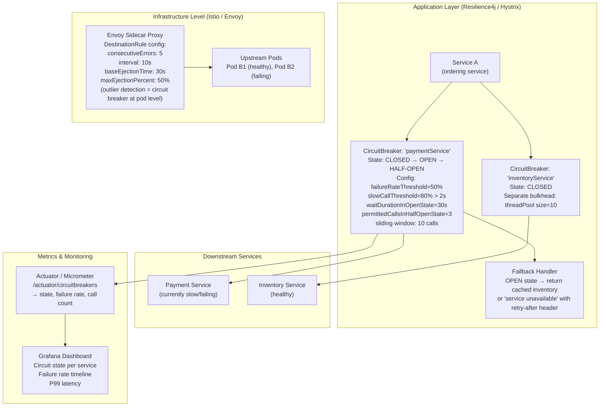
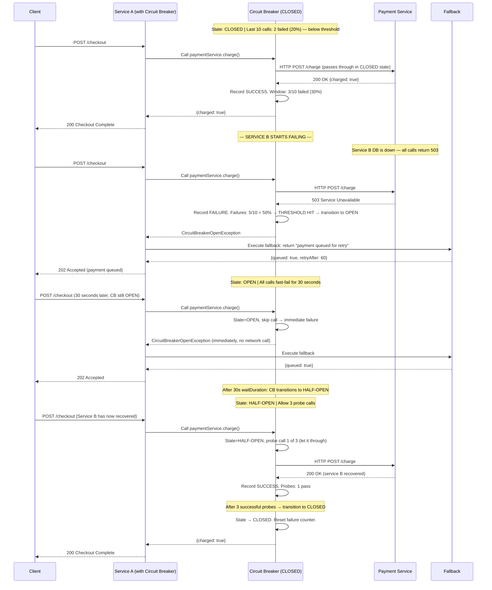
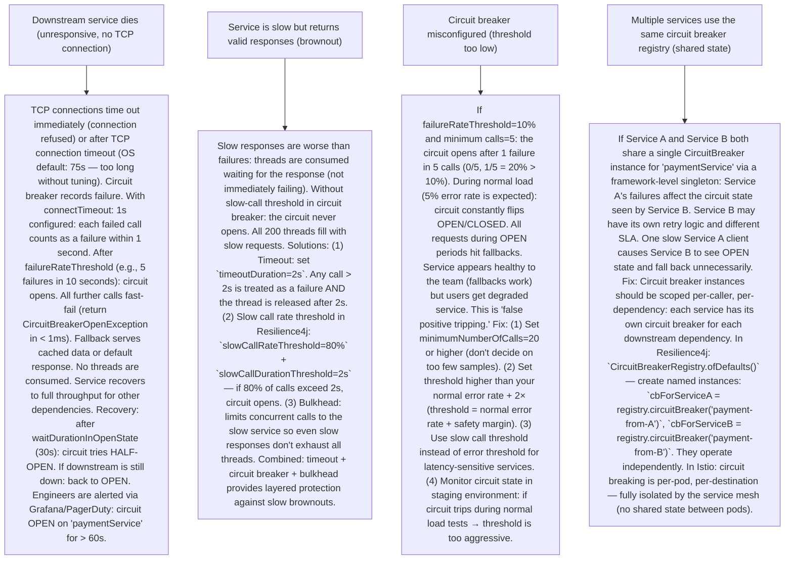

# P4 — Circuit Breaker & Resilience (like Netflix Hystrix, Resilience4j, Istio)

---

## ELI5 — What Is This?

> In your house, an electrical circuit breaker watches for overloads.
> If too much current flows (a fault): the breaker trips open.
> No more current flows — preventing a fire.
> After the problem is fixed: you reset the breaker (test if it's safe), then close it again.
> The Circuit Breaker Pattern works the same way for service calls in microservices.
> If Service A calls Service B and B keeps failing (timeout, error, crash):
> the circuit "trips open." Future calls to B immediately return an error (fast fail)
> — without even trying. This prevents A from drowning in slow/hanging requests.
> After a reset timeout: the circuit allows a test request (HALF-OPEN).
> If it succeeds: circuit closes again (B is healthy). If it fails: stays OPEN.
> This is how Netflix's Hystrix, Resilience4j, and Istio's service mesh protect
> distributed systems from cascading failures.

---

## Glossary (Every Keyword Explained in ELI5)

| Word | ELI5 Meaning |
|---|---|
| **Circuit Breaker** | A proxy that tracks the success/failure rate of calls to a downstream service. Three states: CLOSED (normal), OPEN (tripped, fast-fail all calls), HALF-OPEN (testing if the service recovered). |
| **CLOSED state** | Normal operating state. Calls pass through to the downstream service. The circuit breaker counts failures. If failures exceed a threshold: transitions to OPEN. "The breaker is closed" = current flows = requests pass through. |
| **OPEN state** | Tripped state. All calls immediately return an error (or fallback) WITHOUT calling the downstream service. This "fast fails" rather than queuing up slow requests. After a reset timeout (e.g., 30 seconds): transitions to HALF-OPEN. "The breaker is open" = circuit is broken = no requests pass through. |
| **HALF-OPEN state** | Recovery test state. Allows a limited number of probe requests through to the downstream service. If probes succeed: transitions to CLOSED (service is healthy). If probes fail: transitions back to OPEN. |
| **Failure Threshold** | The percentage of failures (or count) that triggers the CLOSED → OPEN transition. Example: "trip if 50% of the last 10 calls failed" or "trip if more than 5 calls fail in 10 seconds." |
| **Fallback** | The alternative response when the circuit is OPEN. Can be: empty response, cached response, default value, response from a backup service. Fallback makes the circuit breaker "graceful degradation" — not just fast failure. |
| **Bulkhead Pattern** | Isolate resources (thread pools, connection pools, semaphores) per downstream dependency. If Service B's thread pool is full: requests to B are rejected without affecting thread pools for Services C and D. Like watertight bulkheads in a ship — one compartment floods, others stay dry. |
| **Timeout** | Maximum time to wait for a downstream response. Without a timeout: a single slow service can exhaust all threads waiting for it. Timeouts and circuit breakers work together: timeouts prevent infinite waits, circuit breakers prevent repeated attempts to a failing service. |
| **Retry with Exponential Backoff** | On transient failure: retry after 1s, then 2s, then 4s (exponential). Prevents "retry storm" where all retrying clients hammer a recovering service simultaneously. Jitter (random delay): adds random offset to backoff to spread retries across time. |
| **Resilience4j** | A Java library (successor to Hystrix) providing Circuit Breaker, Bulkhead, Rate Limiter, Retry, and TimeLimiter. Functional programming style. Used via annotations (`@CircuitBreaker`) or direct API. |
| **Hystrix (deprecated)** | Netflix's original circuit breaker library (Java). Introduced bulkhead via thread pool isolation per dependency. Netflix stopped active maintenance (2018). Resilience4j is the recommended replacement. Hystrix Dashboard: real-time metrics showing circuit states for all dependencies. |
| **Istio Service Mesh** | A service mesh that implements circuit breaking at the infrastructure level (Envoy sidecar proxy), not the application level. No code changes needed. Configured via `DestinationRule` custom resources in Kubernetes. |

---

## Component Diagram

---

## Step-by-Step Request Flow

---

## Bottlenecks — Every Point Explained

| # | Bottleneck | Why It Hurts | Fix |
|---|---|---|---|
| 1 | **Thread pool exhaustion (no bulkhead)** | Without bulkheads: all services share one thread pool. Service B is slow (200ms avg response, degraded to 5s). Thread pool of 200 threads: 200 requests in-flight to Service B simultaneously. Service A wants to call Service C (fast) — but all threads are consumed by blocked Service B calls. Service A can't process new requests at all. Cascading failure: one slow dependency starves all other operations. Found in early Netflix monolith (pre-Hystrix). | Bulkhead pattern: isolate thread pools per dependency. Service B gets 20 threads, Service C gets 20 threads. Service B's pool fills (20 requests blocked) → Service B requests are rejected immediately. Service C's pool is unaffected. Services can still call C. Resilience4j BulkheadConfig: `maxConcurrentCalls=20`, `maxWaitDuration=0ms` (reject immediately if full). Semaphore-based bulkhead: limits concurrent calls without a separate thread pool (lower overhead). Thread pool-based: supports timeouts (thread is killed after N seconds) but higher overhead. |
| 2 | **Slow circuit breaker opening (too high threshold)** | If failure threshold is set to 80%: the circuit doesn't open until 80% of calls fail. With 10-call sliding window: 8 out of 10 must fail before tripping. During the 8 failing calls: each one waits for the timeout (e.g., 5 seconds). 8 calls × 5 seconds = 40 seconds of slow responses reaching clients before the circuit opens. During this window: threads are held, backlog builds, queue fills. | Tune thresholds aggressively: set failure rate threshold to 50% or lower. Use slow call threshold (calls exceeding 2 seconds count as failures even if they return 200 OK). Sliding window: time-based (e.g., failures in the last 10 seconds) rather than count-based (last N calls) is more reactive to bursts. Minimum number of calls: set to 5 (don't trip circuit on 1-2 calls during low traffic). In practice: start with 50% failure threshold, 5 second slow-call threshold, 30 second open wait. Tune based on production behavior. |
| 3 | **Thundering herd on HALF-OPEN** | When circuit transitions from OPEN to HALF-OPEN: all waiting requests see HALF-OPEN and rush through simultaneously. If the service is only partially recovered (can handle 10 req/s, not 1000 req/s): the flood of probe requests re-overwhelms it. Circuit immediately goes back to OPEN. Service never fully recovers. | The HALF-OPEN design already prevents this: `permittedCallsInHalfOpenState=3`. Only 3 test calls are allowed. All others are still fast-failed during HALF-OPEN. The 3 probes evaluate success → then circuit closes and full traffic flows. If the service can't handle even 3 requests: it's not ready. Combined with exponential backoff in client retries: staggered load on recovery. At infrastructure level: Istio's outlier detection uses ejection/recovery cycles with `baseEjectionTime` doubling on repeated failures (10s, 20s, 40s) — backs off from repeatedly ejecting/injecting a flaky pod. |
| 4 | **Fallback hides real problems** | A well-designed fallback (show cached data, return default) is good UX. But if ALL failures silently fall back: the engineering team doesn't know something is wrong. No alerts fire. Users see slightly degraded service for hours. The real problem (downstream DB is down) goes unnoticed. Technical debt accumulates while the system appears healthy. | Obligatory alerting alongside fallback: every fallback invocation should increment a metric (`circuit_opened_count`, `fallback_invocations`). Alert when fallback invocation rate exceeds baseline. Alert when circuit is OPEN for > 60 seconds. Distinguish between "controlled fallback" (expected degradation) vs "unexpected circuit opening." Dashboards: show circuit state (CLOSED/OPEN/HALF-OPEN) for all downstream dependencies in your service graph. Log the full error on first fallback invocation for each circuit opening. |
| 5 | **Retry amplification without circuit breaker** | Without circuit breaker: each failing service retries. If 1000 clients send requests to Service A, A calls B, B is down. With 3 retries each: Service A makes 3000 calls to Service B. If Service A itself has 3 layers of retry (middleware + service + client): 9000 calls to B. Exponentially worsens the overload. Service B cannot recover under this load. Network is flooded. | Circuit breaker + retry together: retry handles transient failures (network blip, single slow response). Circuit breaker handles persistent failures (service is down for minutes). Rule: retry first (3 attempts with backoff). If retries fail → circuit breaker records failures → after threshold: circuit opens → NO more retries until HALF-OPEN. Jitter on retry backoff: prevent synchronized retries across clients (all retrying at T+1, T+2 simultaneously). Also: exponential backoff caps at a maximum (e.g., 30 seconds between retries) to prevent permanent blocking. |

---

## What Happens When Each Part Fails?

---

## Key Numbers to Know

| Metric | Value |
|---|---|
| Typical failure rate threshold | 50% |
| Typical slow call duration threshold | 2 seconds |
| Typical OPEN state wait (reset timeout) | 30 seconds |
| HALF-OPEN permitted calls | 3–5 |
| Sliding window size (count-based) | 10–100 calls |
| Thread pool bulkhead size (per dependency) | 10–50 threads |
| Netflix Hystrix timeout default | 1000ms (1 second) |
| Istio outlier detection: consecutive errors | 5 before ejection |
| Istio base ejection time | 30 seconds (doubles each ejection) |
| Max ejection percent (Istio) | 50% (never ejects all pods) |

---

## How All Components Work Together (The Full Story)

A distributed system is only as reliable as its weakest dependency. If Service B has 99% uptime BUT Service A calls it 10 times per request: Service A's uptime = 0.99^10 = 90%. Add 20 such dependencies: 0.99^20 = 82% uptime even if every service is 99% available.

**Without circuit breaker:** A slow dependency cascades. Service A waits for Service B. Service A's thread pool fills. Requests to Service A queue. Service A becomes slow too. Every service calling Service A queues. Full cascade failure in minutes. Netflix experienced this in 2011 — a single slow dependency took down their entire streaming service.

**Circuit breaker as the solution:**
The circuit breaker wraps every outbound call. It tracks the failure rate on a sliding window. When failures exceed the threshold: the circuit OPENS and all calls are immediately rejected (no network call made). Clients get fast failures instead of slow hangs. Threads are freed. Service recovers to serve other traffic.

**Fallback makes it graceful:** Instead of "500 Internal Server Error": return a cached version, a default empty response, or redirect to a backup. Users experience degraded service (not broken service). For Netflix: "recommendations unavailable — please check back later" instead of a blank page.

**Bulkhead adds isolation:** Each downstream dependency gets a fixed thread pool. Slow dependency B can only consume its own 20 threads. Dependencies C, D, E use their own pools. B's problems don't cascade to C, D, E.

**Istio moves it to infrastructure:** Application developers don't write `@CircuitBreaker` annotations. The Envoy sidecar proxy (injected automatically in Kubernetes) implements outlier detection (circuit breaking at the pod level). No code change needed. Every service in the mesh gets circuit breaking for free.

> **ELI5 Summary:** If a road is blocked (car crash = service failure): don't put more cars on that road while it's blocked (retrying a failing service). Reroute them to a detour (fallback). Send a scout car after 30 seconds to check if the road is clear (HALF-OPEN). If the road is clear: reopen it for all cars. The circuit breaker is the traffic controller.

---

## Key Trade-offs

| Decision | Option A | Option B | Why |
|---|---|---|---|
| **Thread-pool bulkhead vs semaphore bulkhead** | Thread pool: each dependency has a dedicated thread pool. On timeout: the thread is interrupted and released. Higher memory overhead (each pool has N idle threads). Supports async execution — caller thread is freed while waiting. | Semaphore: limits concurrent calls via a counter (semaphore). No separate threads. Caller thread blocks while waiting for the semaphore slot. Lower overhead but no timeout support (blocking caller thread). | **Thread pool for dependencies with timeouts (most cases):** you want to be able to timeout a slow dependency and release the caller thread. Semaphore for fast, low-latency dependencies where thread overhead matters and timeouts aren't needed. Resilience4j recommends thread pool unless performance constraints force semaphore. |
| **Library-level CB (Resilience4j) vs Mesh-level CB (Istio)** | Resilience4j: code-level, with fallback logic, per-method circuit breakers, full control over fallback behavior. Requires code changes. Rich fallback options (different strategies per exception type). | Istio: infrastructure-level, no code changes, applies uniformly across all services. Less granular (applies per-destination-service, not per-method). Fallback is limited (return 503, not a rich fallback response). | **Use both:** Istio handles infrastructure-level resilience (outlier detection, connection limits) uniformly. Resilience4j handles application-level resilience (method-level circuit breakers, rich fallbacks, retry logic). They complement: Istio protects when the whole pod is down; Resilience4j protects when the endpoint is slow or returns partial errors. |
| **Eager fallback (always fallback on first failure) vs Lazy fallback (only after circuit opens)** | Eager: retry once, then fall back. User sees failure quickly. Circuit doesn't accumulate failures slowly. But can hide intermittent errors. | Lazy (standard circuit breaker): accumulate N failures before tripping circuit. Retry attempts happen before fallback. More failures before the user gets fallback. | **Standard circuit breaker (lazy) with smart retry:** retry 1 time (jitter + immediate retry for transient errors). Record all retried-then-failed calls as failures. Circuit breaker evaluates the failure rate on final outcomes (after retries). This way: transient errors are handled by retry. Persistent failures accumulate and trip the circuit. Don't retry on 4xx errors (client errors — no point retrying). Only retry on 5xx + network timeouts. |

---

## Important Cross Questions

**Q1. Explain the three states of a circuit breaker and what triggers each transition.**
> CLOSED (normal): Requests pass through to the downstream service. The circuit breaker counts calls in a sliding window. As long as the failure rate stays below the threshold: state remains CLOSED. Transition CLOSED → OPEN: Failure rate exceeds `failureRateThreshold` (e.g., 50%) within the sliding window (e.g., last 10 calls) AND the minimum number of calls has been reached (e.g., 5 calls). OPEN (tripped): All calls immediately return CircuitBreakerOpenException. No actual network calls made. This fast-fails for `waitDurationInOpenState` (e.g., 30 seconds). Transition OPEN → HALF-OPEN: After the wait duration expires, the circuit transitions to HALF-OPEN automatically. HALF-OPEN (probing): `permittedCallsInHalfOpenState` (e.g., 3) test calls are allowed through. All other calls still fast-fail. Transition HALF-OPEN → CLOSED: If all permitted calls succeed (failure rate < threshold): circuit closes. Normal operations resume. Transition HALF-OPEN → OPEN: If any permitted call fails: circuit trips back to OPEN. Wait duration resets.

**Q2. How does Netflix Hystrix differ from Resilience4j?**
> Hystrix (2014): RxJava-based, thread pool isolation per command, HystrixCommand annotation. Reactive-imperative hybrid. Metrics aggregated via RxJava observables. Real-time dashboard (Hystrix Dashboard). Multiple service circuits visible at once. Netflix announced maintenance mode (2018) — no new features. Key issue: thread pool per command has high overhead, synchronous execution model. Resilience4j (2017): functional, modular. Built for Java 8+ (lambdas, functional interfaces). Modules: CircuitBreaker, Bulkhead (thread pool AND semaphore), RateLimiter, Retry, TimeLimiter (timeout), Cache. Integrated with Micrometer for metrics (Prometheus, Grafana). Spring Boot Actuator endpoint shows circuit states. `@CircuitBreaker` annotation (via Spring Cloud Circuit Breaker abstraction). Reactive support (WebFlux + Project Reactor). Key advantage: composable decorators. Wrap the same function with: `Decorators.ofSupplier(fn).withCircuitBreaker(cb).withRetry(retry).withBulkhead(bh).get()`. Resilience4j is the recommended migration path from Hystrix.

**Q3. How does Istio implement circuit breaking without application code changes?**
> Istio injects an Envoy sidecar proxy alongside every pod. All outbound traffic from the pod passes through the sidecar. Istio configures Envoy via a `DestinationRule` custom resource: `outlierDetection: consecutiveErrors: 5, interval: 10s, baseEjectionTime: 30s, maxEjectionPercent: 50%`. This is Envoy's "outlier detection": if a pod returns 5 consecutive errors within 10 seconds → that pod is ejected from the load balancer pool for 30 seconds. After 30 seconds: the pod is re-tried. If it fails again: ejected for 60 seconds (doubles). `maxEjectionPercent: 50%` prevents all pods from being ejected simultaneously (maintains at least 50% capacity). This is circuit breaking at the connection level: if one pod in the `payment-service` deployment is slow/failing: Istio's load balancer stops sending traffic to that specific pod (outlier detection), while other healthy pods continue receiving traffic. Different from application-level CB (which trips on aggregate service failure). Istio also supports connection pool limits: `connectionPool.http.http1MaxPendingRequests: 1000` — rejects requests when the service is backlogged.

**Q4. What is the difference between a Circuit Breaker and a Rate Limiter?**
> Circuit Breaker: responds to downstream failure signals (high error rate, slow responses). Opens when the remote service is being unhealthy. Protects the caller from being overwhelmed by retrying a failing service. Directionality: outputs from the caller to the downstream. Rate Limiter: controls how fast requests are ACCEPTED by a service (inbound). Protects the callee from being overwhelmed by too many callers. `@RateLimiter(limitForPeriod = 100, limitRefreshPeriod = 1s)` — accept max 100 requests per second, reject the rest with 429 Too Many Requests. Directionality: inputs to the receiving service. They work together: the rate limiter protects a service from being called too fast. The circuit breaker protects a service from calling a slow dependency. A complete resilience strategy uses both: rate limiter + circuit breaker + bulkhead + retry + timeout in layered combination.

**Q5. How do you test a circuit breaker in production?**
> Options: (1) Chaos Engineering (Chaos Monkey / Chaos Mesh in Kubernetes): deliberately kill a pod, inject latency, or return 503 errors from a service. Observe: does the circuit breaker trip? Does the fallback activate? Do metrics alert? Does the system recover when chaos stops? (2) Shadow testing: run a second version of the circuit breaker with lower thresholds in shadow mode (tracking state but not enforcing). See when it would have tripped in production. (3) Load testing with simulated failures: in staging. Slowly increase error rate from 0% to 100%. Verify that circuit trips at the expected threshold and fallback activates. Verify circuit closes after service recovery. (4) Resilience4j `@TestCircuitBreaker` utilities: force state transitions in unit tests. Test fallback logic independently of actual downstream failures. (5) Monitor: Grafana dashboard with circuit state timeline. After each incident: verify that circuit breaker did trip (or should have tripped) when the downstream failed.

**Q6. What's the "umbrella" mistake people make when setting up circuit breakers?**
> The "coarse-grained circuit breaker" mistake: wrapping an entire service (all endpoints) in one circuit breaker. If `GET /products` (fast, read) and `POST /orders` (complex, slow) both use the same circuit breaker for OrderService: a surge of slow `POST /orders` failures trips the circuit, blocking all `GET /products` calls too (which were working fine). The circuit is too coarse. Fix: one circuit breaker per endpoint or per logical operation group. "ProductRead" circuit breaker and "OrderWrite" circuit breaker are independent. If writes are failing: reads still work. In Resilience4j: name circuit breakers per logical operation: `@CircuitBreaker(name = "order-write-service")` vs `@CircuitBreaker(name = "product-read-service")`. Another mistake: not implementing fallback (circuit opens → 500 error). Fallback must be part of the initial design, not retrofitted after an incident. A circuit breaker without a fallback just converts slow failures into fast failures — better, but still a bad user experience.

---

## Real-World Apps That Use This Pattern

| Company | Product | How They Use It |
|---|---|---|
| **Netflix** | Streaming Platform | Created Hystrix (2011, open-sourced 2012) after "the great outage". Every service-to-service call wrapped in a HystrixCommand. Real-time circuit state visible on Hystrix Dashboard. Fallbacks: show "popular movies" (cached) when recommendation service is OPEN. `simpleCache` tier as fallback for metadata service. Netflix processes 1B+ API calls/day — circuit breakers are essential for isolating failure blast radius. |
| **Resilience4j** | Java Ecosystem | The open-source successor to Hystrix. Used at scale by Zalando, Otto Group, OTTO, and many European e-commerce platforms. Spring Boot + Resilience4j is the standard stack for Java microservices. @CircuitBreaker, @Bulkhead, @Retry annotations backed by Resilience4j. Micrometer integration provides Prometheus metrics and Grafana dashboards out of the box. |
| **Istio** | Service Mesh (Kubernetes) | Google, Lyft, IBM co-created Istio (2017). Outlier detection configuration in DestinationRule provides circuit breaking for any language/framework without code changes. Large adopters: eBay (50K+ services), T-Mobile, Auto Trader. All traffic between pods flows through Envoy proxies. Circuit breaking, mTLS, distributed tracing all enforced at the mesh level. |
| **AWS** | SDK + API Gateway | AWS SDK clients (Java, Python, Node.js) implement built-in retry with exponential backoff + jitter. Circuit breaking in SDK-level via adaptive retry mode (automatically adjusts retry behavior based on success rates). AWS API Gateway: integration timeout (29 seconds max) + throttling per API key = rate limiter at gateway level. AWS App Mesh uses Envoy for circuit breaking in AWS-native environments. |
| **Spotify** | Music Streaming | Spotify's backend (renamed from Helios to their platform services) uses circuit breakers per dependency. Each microservice (20K+ at Spotify) has circuit breakers on dependencies. Spotify uses Apollo (their service framework) which includes built-in circuit breaking, timeouts, and retry logic with Hystrix-style semantics. Fallback: serve cached playlist data when recommendation engine is slow. Album art CDN has circuit breaker fallback: serve a generic placeholder image when CDN is unresponsive. |
