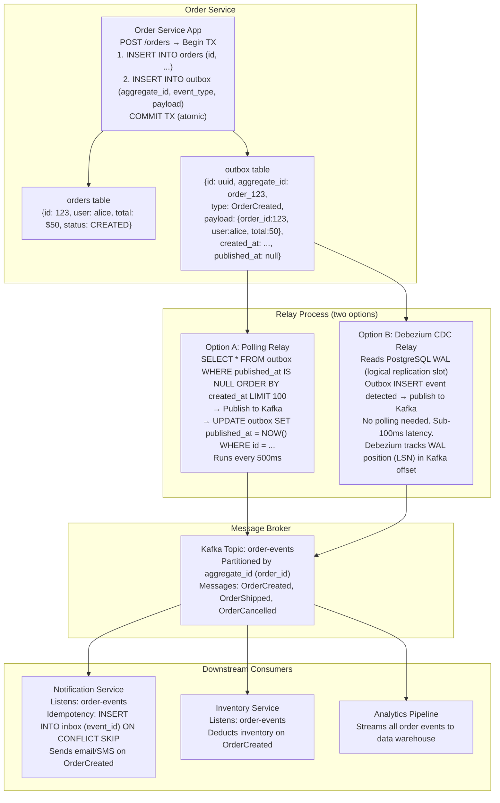
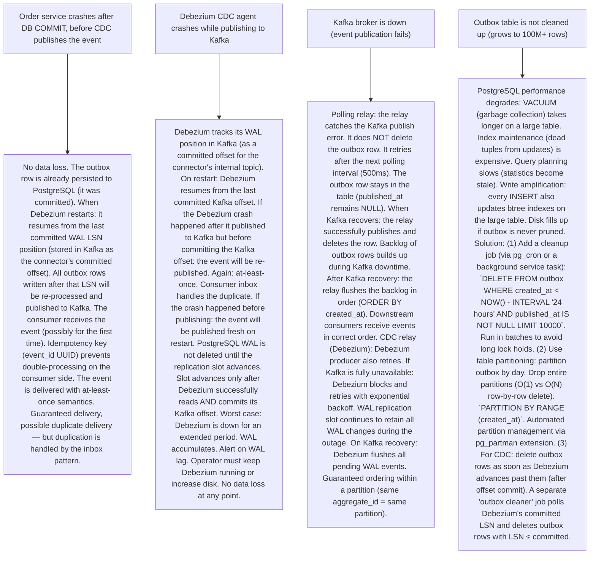

# P5 — Outbox Pattern (like Debezium, Confluent CDC, Microservices at Scale)

---

## ELI5 — What Is This?

> Imagine you run a shop. Every time a customer places an order (you write to your order ledger),
> you also need to send a notification to the warehouse (publish a message to a queue).
> Two separate actions: write to ledger + send to warehouse.
> What if you write the order but then your phone dies before you can call the warehouse?
> The order is in your ledger but the warehouse has no idea!
> Or worse: you call the warehouse first, tell them "order 123 is coming!"
> Then the power goes out before you write to your ledger.
> The warehouse is preparing a ghost order that doesn't actually exist.
> The Outbox Pattern solves this with one trick:
> When you write the order: also write "send warehouse notification" on a sticky note
> in the SAME ledger page (same transaction, atomically). A postal worker (relay process)
> reads your sticky notes periodically and sends the notifications to the warehouse.
> Now: writing the order and scheduling the notification are always atomic.
> The postal worker handles retries if the warehouse line is busy.
> Used by every major microservice platform to reliably publish events from database changes.

---

## Glossary (Every Keyword Explained in ELI5)

| Word | ELI5 Meaning |
|---|---|
| **Dual-Write Problem** | The root cause the Outbox Pattern solves. A service must write to its own database AND publish a message to a broker (Kafka). If done separately: a crash between the two operations leaves the system inconsistent (DB committed but no message, OR message sent but DB not committed). |
| **Outbox Table** | A special table in the same database as your business data. It stores pending events to be published. The business transaction inserts into both the main table AND the outbox table atomically (same DB transaction). The event is durably scheduled even before it reaches the broker. |
| **Relay / CDC Processor** | A background process that reads the outbox table and publishes events to the message broker (Kafka, RabbitMQ). Can work via polling (SELECT from outbox, then DELETE after publish) or via CDC (watch the database's transaction log for outbox table changes). |
| **Change Data Capture (CDC)** | A technique that reads a database's transaction log (WAL in PostgreSQL, binlog in MySQL) and streams every data change as events. Debezium is the most popular CDC tool. CDC-based relay is more efficient than polling: events are emitted as they happen, not on a schedule. |
| **WAL (Write-Ahead Log)** | PostgreSQL's transaction log. Every INSERT, UPDATE, DELETE is written to the WAL before the change is applied to the data pages. WAL streaming replication (read replicas) uses this log. Debezium reads the WAL via the PostgreSQL logical replication protocol to capture outbox table changes. |
| **Debezium** | Red Hat's open-source CDC platform. Connects to PostgreSQL/MySQL/MongoDB and streams their transaction logs to Kafka topics. For the Outbox Pattern: Debezium reads outbox table changes from the WAL and publishes them to Kafka. No polling, near-real-time (sub-second latency). |
| **Idempotent Consumer** | The event consumer (downstream service) must handle receiving the same event twice without side effects. The relay guarantees at-least-once delivery (it can deliver duplicates if it restarts). Consumers use an idempotency key (event ID) to detect and skip duplicates. |
| **Transactional Outbox** | The name for the combination of (1) inserting into the outbox table within the business transaction and (2) a relay process that publishes from the outbox to the broker. This is the full Outbox Pattern. "Transactional" refers to the atomicity between the business write and the outbox write. |
| **Inbox Pattern** | The consumer-side counterpart to the Outbox Pattern. When a service receives a message: before processing, it writes the message ID to an "inbox" (deduplication) table in its own database — within the same transaction as processing the message. If the same message arrives again: inbox lookup prevents double-processing. |
| **Exactly-Once Semantics** | Message delivery guarantee where each message is processed exactly once (not more, not less). Achieved by combining: at-least-once delivery (Outbox with retry) + idempotent consumer (Inbox). The Outbox Pattern itself only guarantees at-least-once delivery from the source. The consumer is responsible for the "at-most-once" processing side. |

---

## Component Diagram



---

## Step-by-Step Request Flow

```mermaid
sequenceDiagram
    participant Client
    participant OrderSvc as Order Service
    participant DB as PostgreSQL (orders + outbox tables)
    participant CDC as Debezium CDC Agent
    participant Kafka
    participant NotifSvc as Notification Service
    participant InboxTable as Notification Service Inbox Table

    Note over Client,InboxTable: === HAPPY PATH ===
    Client->>OrderSvc: POST /orders {user: alice, items: [...]}
    OrderSvc->>DB: BEGIN TRANSACTION
    OrderSvc->>DB: INSERT INTO orders VALUES (id=123, user=alice, total=50, status=CREATED)
    OrderSvc->>DB: INSERT INTO outbox VALUES (id=evt-uuid-1, aggregate_id=order-123, type=OrderCreated, payload=JSON)
    OrderSvc->>DB: COMMIT
    DB-->>OrderSvc: COMMIT OK
    OrderSvc-->>Client: 201 Created {orderId: 123}

    Note over CDC: CDC agent is streaming PostgreSQL WAL
    CDC->>DB: Read WAL: new row in outbox table detected (LSN: 1234)
    CDC->>Kafka: Publish to topic 'order-events' partition 3 (hash of order-123), key=order-123, value=OrderCreated payload
    Kafka-->>CDC: offset 450 committed
    CDC->>DB: Update Debezium offset: LSN 1234 → 1235 (slot position advanced)

    Note over NotifSvc: Notification service consumes from Kafka
    NotifSvc->>Kafka: Poll messages from 'order-events' partition 3
    Kafka-->>NotifSvc: message: OrderCreated {order_id: 123, user: alice}
    NotifSvc->>InboxTable: BEGIN TX; INSERT INTO inbox (event_id=evt-uuid-1) ON CONFLICT SKIP; (idempotency check)
    InboxTable-->>NotifSvc: Inserted (new event, not a duplicate)
    NotifSvc->>NotifSvc: Send email to alice (order confirmation)
    NotifSvc->>Kafka: Commit offset (processed successfully)

    Note over Client,InboxTable: === CRASH SCENARIO: Order service crashes after COMMIT but before CDC publishes ===
    Note over OrderSvc: Service restarts. The outbox row still exists with published_at = NULL.
    CDC->>DB: On restart: resume from last committed WAL position. The outbox INSERT is still in the WAL.
    CDC->>Kafka: Re-publish the event (at-least-once delivery)
    NotifSvc->>InboxTable: INSERT INTO inbox (event_id=evt-uuid-1) ON CONFLICT SKIP
    InboxTable-->>NotifSvc: CONFLICT (already processed) → SKIP
    Note over NotifSvc: Duplicate event detected via inbox. Email NOT sent twice. Idempotency works.
```

---

## Bottlenecks — Every Point Explained

| # | Bottleneck | Why It Hurts | Fix |
|---|---|---|---|
| 1 | **Outbox table becomes a hot table (polling)** | With polling relay (SELECT WHERE published_at IS NULL): every 500ms, a query runs on the outbox table. At high event rates (10K events/second): the outbox table grows quickly. The polling query becomes expensive. Adding an index on `published_at IS NULL` helps but the index must be updated on every INSERT (slows writes). The polling relay holds a DB connection and runs queries in tight loops. Competes with application writes for DB connection pool slots. | Switch to CDC (Debezium): CDC reads from the WAL (transaction log), not from a table query. Zero overhead on the application's primary workload. No polling queries. Outbox table entries don't need a `published_at` column for CDC-based relay (Debezium marks published events by advancing the WAL offset, not by updating rows). Alternatively: partition the outbox table by time. Archive old published records to a history table. Keep the active outbox table small (only unpublished events). Delete published rows promptly. |
| 2 | **CDC replication lag under high write load** | Debezium reads PostgreSQL WAL via a logical replication slot. The WAL is written at the rate of all database writes (not just outbox). At very high write rates (100K writes/second): Debezium must process the WAL at the same rate or fall behind. If Debezium falls behind: the replication slot grows (WAL files are retained, not deleted). PostgreSQL WAL accumulation can fill the disk. Disk full = database crash. | Monitor replication slot lag: `pg_replication_slots` view shows `lag_bytes` (WAL retained for the slot). Alert when lag_bytes > threshold. Increase Debezium consumer throughput: increase `max.batch.size` and `max.queue.size` in Debezium config. If Debezium cannot keep up long-term: pre-filter WAL events (only capture outbox table changes, not all tables). Use `include.list = orderservice.outbox` in Debezium config. This dramatically reduces event volume Debezium must process. Set `publication.min_replication_lag` to alert before disk fills. |
| 3 | **Large outbox payloads slow Kafka throughput** | Storing full order object in outbox payload (1KB-10KB per event). At 10K orders/second: 10MB-100MB/second of throughput through Kafka. Large messages increase serialization/deserialization time. Kafka default max message size: 1MB. Large messages require producer + broker config changes (`message.max.bytes`, `max.request.size`). Complex consumers processing large payloads take longer per message. | Keep payloads small: publish minimal event data (aggregate ID + event type + key fields). Consumers query the service for full data if needed ("fat event" vs "thin event" trade-off). Thin events: `{type: OrderCreated, orderId: 123}` — consumer queries Order service for full details. Pros: small Kafka messages. Cons: extra DB read per event (N+1 query pattern). Fat events: `{type: OrderCreated, orderId: 123, userId: alice, total: 50, items: [...]}` — consumer has all data. Pros: no additional queries. Cons: large messages, tight coupling between event producer and consumer (schema changes are harder). Best practice: fat events with schema registry (Avro + Confluent Schema Registry). |
| 4 | **Outbox records not deleted (table grows unbounded)** | If the relay marks records as "published" (updates `published_at`) but never deletes them: the outbox table grows forever. At 10K events/second: 864 million rows per day. PostgreSQL performance degrades on very large tables (VACUUM, index maintenance, query planning). | Delete or archive published outbox records: (1) Polling relay: immediately DELETE rows after successful Kafka publish. (2) CDC relay: maintain a separate cleanup job: `DELETE FROM outbox WHERE created_at < NOW() - INTERVAL '1 day'`. Run during off-peak hours. (3) For auditability: stream outbox events to a separate "event history" table (or directly to a data warehouse via Kafka) before deleting. The outbox is an operational table (temporary staging), not a permanent event store. If you need permanent event history: use Event Sourcing (Pattern P1) as the primary store. |
| 5 | **Consumer at-least-once without inbox = double processing** | The relay guarantees at-least-once delivery (network failure after Kafka publish but before outbox row deletion = re-publish). Consumer must handle duplicates. If a consumer sends an email on every received event — duplicate events send duplicate emails. If a consumer deducts inventory on every event — inventory is over-deducted on duplicates. | Inbox pattern: consumer writes event ID to inbox table within the same transaction as its processing. If event arrives again: inbox lookup detects duplicate, skip processing. Database-level deduplication: `INSERT INTO inbox (event_id) ON CONFLICT DO NOTHING`. Check rows_affected: if 0 rows inserted → duplicate, skip. Events must carry a globally unique idempotency key (`event_id` or aggregate_id + sequence number). The Kafka message key (aggregate_id) doesn't guarantee uniqueness — use a per-event UUID. |

---

## What Happens When Each Part Fails?



---

## Key Numbers to Know

| Metric | Value |
|---|---|
| Debezium CDC latency (WAL → Kafka) | 10–100ms (sub-second) |
| Polling relay latency | 500ms–2s (depends on poll interval) |
| Debezium max WAL lag before disk risk | Depends on PostgreSQL `max_wal_size` (default 1GB) |
| Typical outbox row size | 100 bytes – 5 KB (depends on payload) |
| Kafka message max size (default) | 1 MB (increase to 10MB for large payloads) |
| Inbox table deduplication lookup | < 1ms (primary key lookup) |
| Debezium connectors in production (Confluent) | Thousands of connectors per cluster |
| PostgreSQL logical replication slots | 1 per CDC consumer |

---

## How All Components Work Together (The Full Story)

The Outbox Pattern exists because **databases and message brokers are separate transactional resources**. There is no free atomic commit across them. Distributed transactions (XA/2PC) across DB + Kafka exist on paper but are operationally complex, slow, and rarely used in practice. The Outbox Pattern achieves the same reliability guarantee without 2PC.

**The dual-write problem (without Outbox):**
```
// DANGEROUS: Two separate operations, no atomicity
db.insert("INSERT INTO orders ...");       // Commits
messageBroker.publish("OrderCreated ...");  // What if this fails?
```
Or:
```
messageBroker.publish("OrderCreated ...");  // Published
db.insert("INSERT INTO orders ...");       // What if this fails? Phantom event.
```

**The Outbox Pattern (safe):**
```
// SAFE: Both writes in ONE DB transaction
db.transaction(() => {
  db.insert("INSERT INTO orders (id=123) ...");
  db.insert("INSERT INTO outbox (event_type='OrderCreated', payload=...) ...");
  // COMMIT: orders row AND outbox row are persistent together
});
// Separate relay process reads outbox and publishes to Kafka
// If relay crashes: DB already has the outbox row → retry on restart
// Idempotent consumers handle duplicate deliveries
```

**CDC vs polling relay:**
Polling: simple to implement (any language can poll a DB table). Higher latency (up to poll interval). Extra DB load (queries + index maintenance). Good for low-throughput scenarios (< 1K events/second).

Debezium/CDC: production-grade. Reads WAL (no queries). Near-real-time. Zero polling overhead. Requires Kafka Connect infrastructure. Good for high-throughput (10K+ events/second). Used at major companies: Airbnb, Shopify, LinkedIn, Stripe (all use CDC-based outbox).

> **ELI5 Summary:** The Outbox Pattern is a "guaranteed mail" system. Instead of rushing to mail a letter immediately at the post office (fragile), you put the letter in your outbox drawer (same action as sealing the letter, atomic). A postal worker reliably picks up letters from your drawer and delivers them, retrying if the post office is temporarily closed. You never lose letters. The post office never receives letters for sealed envelopes that don't exist.

---

## Key Trade-offs

| Decision | Option A | Option B | Why |
|---|---|---|---|
| **Polling relay vs CDC relay** | Polling: simple, no extra infrastructure (just a background job), any DB dialect. Higher latency (depends on poll interval). Extra DB load from polling queries. Events marked with `published_at` (UPDATE required after publish). | CDC (Debezium): near-real-time, no polling queries, reads WAL directly. Requires Kafka Connect cluster + Debezium connector. More ops complexity. Only supported DBs with transaction logs (PostgreSQL, MySQL, MongoDB, SQL Server). | **CDC for production at scale.** Polling is great to start with (low engineering investment, no new infrastructure). At >1K events/second: polling query overhead becomes significant. CDC gives better throughput with lower DB load. Debezium is stable and production-proven (Red Hat support, used by thousands of companies). Shopify processes millions of orders/day via CDC-based outbox. |
| **Fat events (full payload in outbox) vs thin events (just IDs)** | Fat events: contain all relevant data. Consumers don't need to query back to the source service. Lower consumer latency. Schema evolution complexity: changing the fat event format requires consumer coordination. Large Kafka messages. | Thin events: minimal data (aggregate ID + event type). Consumers query back for full data if needed. Small Kafka messages. Easy schema evolution (event format is minimal). Extra latency for consumers (need an API call to fetch full data). | **Fat events for event-driven pipelines** where consumers need data immediately and the producer is the source of truth. Thin events for notification patterns where the trigger is more important than the data. Hybrid: send thin event immediately + fat event asynchronously (after enrichment). Most teams start with fat events for simplicity. Add schema registry (Avro + Confluent) for manageable evolution. |
| **Outbox in same DB vs dedicated event store** | Same DB: atomic with business data, no extra infrastructure. Outbox table in MySQL/PostgreSQL alongside orders/users tables. Simple. Outbox grows (must be cleaned up). Limited event history. | Dedicated event store (Event Sourcing): the event IS the data. No separate outbox needed. All state derived from events. Strong audit trail. High complexity: CQRS + event sourcing infrastructure. Requires thorough capability (Axon, EventStoreDB). | **Same DB outbox for most cases.** Event Sourcing is only warranted when event history is the primary business requirement (audit trail, temporal queries, time-travel debugging). Outbox pattern is simpler: your primary database stays relational, and you just add an outbox table. Use the right tool: if you need an auditable history of all state changes as a first-class concept → Event Sourcing (P1). If you just need reliable downstream event delivery → Outbox Pattern. |

---

## Important Cross Questions

**Q1. Why can't we just use a distributed transaction (2PC) between the database and Kafka?**
> Kafka does not support XA (eXtended Architecture) transactions. XA 2PC requires all participants to implement the XA interface (prepare vote + commit). Kafka's transaction protocol (introduced in 0.11) provides atomic writes within Kafka (write to multiple partitions atomically). But there is no cross-system XA between the database (PostgreSQL) and Kafka. Even if Kafka supported XA: 2PC across DB + Kafka would require both systems to hold resources during the prepare phase (seconds of locking). At high throughput (10K orders/second): 2PC becomes a throughput bottleneck. The Outbox Pattern avoids 2PC entirely by using the database as the source of truth for the event (the outbox row is the event). The relay process reads from the outbox (database) and publishes to Kafka. Only one transactional boundary: the DB transaction (orders + outbox). The Kafka publish is a separate, independently retriable operation.

**Q2. How does Debezium guarantee event ordering when publishing to Kafka?**
> Debezium reads the PostgreSQL WAL (Write-Ahead Log), which is a strictly ordered sequential log. Every commit appears in LSN (Log Sequence Number) order. Debezium processes WAL events in LSN order. For Kafka topic partitioning: Debezium uses the table primary key (aggregate_id, e.g., orderId) as the Kafka message key. Kafka guarantees ordering within a partition. Messages with the same key go to the same partition (Kafka's default partitioner: `hash(key) % numPartitions`). Result: all events for `order-123` go to the same Kafka partition → consumers see them in insertion order. Events for different orders can be on different partitions (processed concurrently by consumer group). Global ordering across all orders is NOT guaranteed (only within-order ordering is guaranteed). If global ordering is required: use a single-partition topic (but sacrifices scalability).

**Q3. What is the difference between the Outbox Pattern and Event Sourcing?**
> Event Sourcing: the aggregate state IS the sequence of events. Instead of storing `order.status = SHIPPED`, you store events: `[OrderCreated, ItemPicked, Shipped]`. Current state is derived by replaying all events. The event log IS the database. Outbox Pattern: the aggregate state is stored normally in a relational table (`orders.status = SHIPPED`). The outbox is a secondary store used only to guarantee that an event was published to the message broker. Outbox events are transient (deleted after publishing). They're NOT the primary data store. Key comparison: (1) Complexity: Event Sourcing is much more complex (CQRS, projections, snapshots). Outbox Pattern is simpler (add one table, one relay process). (2) Event history: Event Sourcing provides unlimited queryable event history. Outbox provides ephemeral event staging (events are deleted after publish). (3) Use case: Event Sourcing for audit log, time-travel queries, complex domain models. Outbox for reliable event publishing in standard relational database architectures. They can be combined: Event Sourcing uses an Outbox to reliably publish domain events to Kafka.

**Q4. How does the Inbox Pattern prevent duplicate processing on the consumer side?**
> The consumer receives Kafka messages with at-least-once delivery (the relay retries, Debezium retries). Without deduplication: the same event could trigger duplicate email sends, duplicate inventory deductions, duplicate payment charges. The Inbox Pattern: when the consumer starts processing an event: before any business logic, it writes the event's unique ID to an `inbox` table within the same business transaction. `INSERT INTO inbox (event_id, processed_at) VALUES (?, NOW()) ON CONFLICT DO NOTHING`. Check rows affected: if 0 rows inserted (conflict) → this event was already processed. Skip all business logic. Commit the "no-op" transaction. If > 0 rows inserted → first time seeing this event. Execute business logic. Commit business logic + inbox row together (atomic). If the service crashes after writing to inbox but before committing: the transaction is rolled back. The event_id is not in the inbox. Next delivery re-inserts successfully. The key: inbox write + business logic commit are ONE database transaction. No partial processing.

**Q5. How does the Outbox Pattern handle schema evolution (changing the event payload format)?**
> When the outbox event format changes (e.g., adding a field, renaming a field): existing consumers must handle both old and new formats. Strategies: (1) Schema Registry (Avro + Confluent Schema Registry): events are serialized as Avro with a schema ID. The schema registry enforces backward/forward compatibility rules. Consumers always know the schema version. Adding a field with a default value is backward-compatible (old consumers ignore it). Removing a required field is not compatible. (2) Versioned event types: instead of changing `OrderCreated`, introduce `OrderCreatedV2`. Old consumers subscribe to `OrderCreated`. New consumers subscribe to `OrderCreatedV2`. Deploy consumers first (`OrderCreatedV2` support), then deploy producer (start emitting `OrderCreatedV2`). (3) Event upcasting: similar to P1 (Event Sourcing). The consumer applies transformation rules: if event is V1, add missing fields with defaults → treat as V2. Logic lives in the consumer. (4) Envelope format: wrap events in a `{version: 1, type: OrderCreated, payload: {...}}` envelope. Consumers check the version field and apply appropriate deserialization.

**Q6. Can the Outbox Pattern be used with NoSQL databases (MongoDB)?**
> Yes. MongoDB supports multi-document transactions (introduced in 4.0 with replica sets, 4.2 with sharded clusters). The pattern is identical: within a multi-document transaction, write to the `orders` collection AND to the `outbox` collection. Commit atomically. Debezium's MongoDB connector reads the MongoDB oplog (operation log, MongoDB's WAL equivalent). Debezium captures outbox collection inserts from the oplog and publishes to Kafka. Same guarantees: atomic write + reliable CDC-based relay. Consideration: MongoDB's oplog is a capped collection (fixed size, old entries are overwritten). If Debezium falls behind: oplog entries might be overwritten before they're captured. Monitor Debezium lag carefully on MongoDB. For high-throughput MongoDB workloads: increase oplog size (`replSetResizeOplog` command or initial `oplogSizeMB` configuration). Debezium's MongoDB connector specifically handles oplog-based CDC for the Outbox Pattern.

---

## Real-World Apps That Use This Pattern

| Company | Product | How They Use It |
|---|---|---|
| **Debezium / Red Hat** | Open-Source CDC Platform | The reference implementation for Outbox Pattern via CDC. Debezium connectors for PostgreSQL, MySQL, MongoDB, SQL Server, Oracle, DB2. Kafka Connect-based architecture. Used internally at Red Hat for JBoss/Quarkus microservices. The `debezium-quarkus-outbox` extension provides first-class Outbox Pattern support with automatic outbox table management. |
| **Shopify** | E-Commerce Platform | Shopify processes millions of orders daily. Uses a form of the Outbox Pattern to publish order lifecycle events (OrderCreated, OrderFulfilled, OrderCancelled) to their internal event bus reliably. CDC-based relay ensures events are never lost even during peak traffic (Black Friday: 40K+ orders/minute). Downstream: inventory allocation, fraud detection, merchant notifications all consume these events. |
| **Airbnb** | Booking Platform | Airbnb's reservation system uses the Outbox Pattern to reliably publish booking events to their internal Kafka infrastructure. Booking confirmation, payment processing, host notification, and insurance calculation services all consume booking events. The CDC relay uses Debezium against their MySQL clusters. Airbnb engineering blog discusses their "Database Per Service" pattern and reliable event publishing (2021). |
| **Confluent** | Kafka Platform | Confluent's Kafka Connect + Debezium is THE enterprise solution for implementing the Outbox Pattern at scale. Confluent Schema Registry (Avro) + Kafka Connect + Debezium connectors form a complete Outbox infrastructure. Used by thousands of companies. Confluent provides the `outbox-event-router` Debezium SMT (Single Message Transform) that automatically routes outbox events to the correct Kafka topic based on the `aggregate_type` field in the outbox table. |
| **LinkedIn** | Data Infrastructure | LinkedIn pioneered CDC-based event streaming (Databus, 2012 — the technology that inspired Debezium). LinkedIn's data infrastructure teams use Change Data Capture to stream MySQL binlog changes to Kafka for analytics pipelines, search indexing (Elasticsearch), and microservice event propagation. Databus → Brooklin (LinkedIn's next-gen CDC platform) underpins their entire event-driven architecture. |
