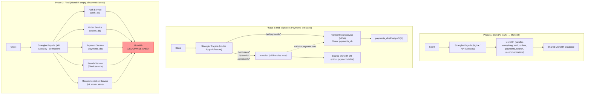
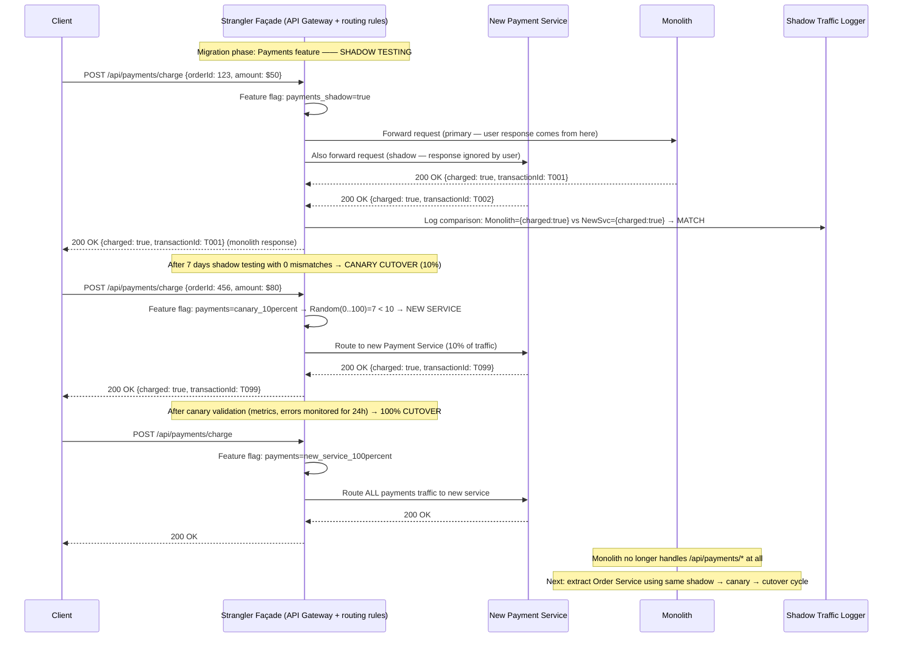
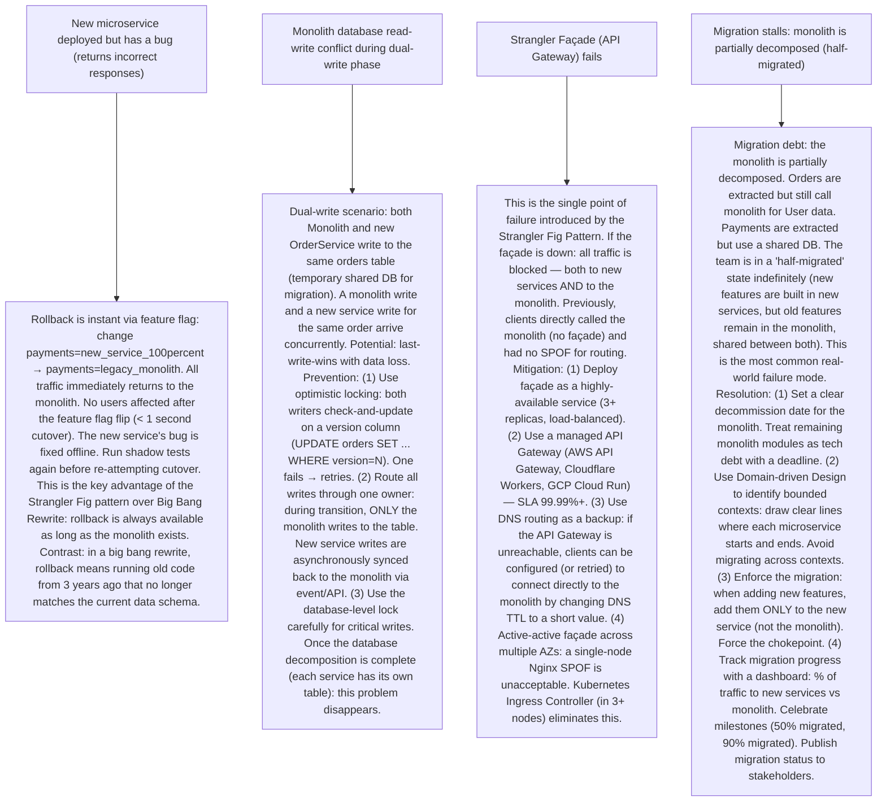

# P6 — Strangler Fig Pattern (like Shopify, Airbnb, Amazon Monolith Decomposition)

---

## ELI5 — What Is This?

> The Strangler Fig is a tropical plant that grows around an existing tree.
> It wraps around the host tree, growing slowly over years.
> Eventually, the fig is strong enough and the old tree rots away inside.
> The new fig tree stands on its own — using the path of the old tree as scaffolding.
> In software: your legacy monolith is the old tree.
> Your new microservices are the strangler fig.
> You don't rewrite everything at once (too risky — what if the rewrite takes 3 years?).
> Instead: you put a facade/proxy in front of the monolith.
> Gradually, you extract one feature at a time as a new service.
> The proxy routes that feature's traffic to the new service instead of the monolith.
> You repeat until all traffic goes to new services.
> The monolith is now empty (rotten) and can be decommissioned.
> No "big bang" rewrite. The system stays live throughout the migration.
> Amazon (2001-2007), Shopify, Airbnb, and LinkedIn all used this approach.

---

## Glossary (Every Keyword Explained in ELI5)

| Word | ELI5 Meaning |
|---|---|
| **Strangler Fig Pattern** | A migration strategy (named by Martin Fowler, 2004) for incrementally replacing a legacy system. Create a façade/proxy in front of the legacy system. Gradually route specific functionality to new services as they're built. The old system handles remaining traffic until all functionality is migrated. |
| **Monolith** | A single-deployment application where all features (authentication, billing, recommendations, search, etc.) are bundled together. Simple to start with. Becomes hard to deploy, scale, and maintain as it grows. The monolith is what you're replacing. |
| **Façade / Proxy (Strangler Facade)** | The traffic router that sits in front of everything. All incoming requests hit the façade. The façade either routes to the new service (if migrated) OR passes through to the monolith (if not yet migrated). Could be: API Gateway (Kong, AWS API Gateway, Nginx), an Edge Service (BFF), or a service mesh. |
| **Decomposition** | The process of extracting one capability (user management, payments, search) from the monolith into its own standalone service with its own database. Each decomposition is independent and doesn't require rewriting the whole system. |
| **Feature Parity** | Before switching traffic from the monolith to the new service: ensure the new service handles ALL scenarios the monolith handles for that feature. Tests: unit, integration, and "shadow traffic" (run both, compare responses). |
| **Shadow Traffic (Dark Launch)** | Run the new service alongside the monolith for the same requests. The monolith response is returned to the user. The new service response is compared (logged) for correctness. No user impact. Used to verify feature parity before cutover. |
| **Strangling (Traffic Cutover)** | The act of routing traffic to the new service instead of the monolith. Can be gradual: 1% → 10% → 50% → 100% using canary deployment or feature flags. Only migrate the traffic when the new service is fully verified. |
| **Shared Database Anti-pattern** | When the new service and the monolith share the same database table. Avoids data migration but creates tight coupling. Cannot change the schema independently. Acceptable as a temporary migration state but must be resolved before full independence. |
| **Database Decomposition** | Separating the monolith's shared database into per-service databases. The hardest part of microservices migration. Requires data migration, API bridges (new service calls monolith for data it doesn't own yet), and eventual full schema ownership. |
| **Big Bang Rewrite** | The anti-pattern: throw away the monolith and rewrite everything from scratch. History: NetSuite (2003-2011 big bang rewrite, delayed product for 8 years). Netscape 6 (rewrote Navigator from scratch: 3 years late, market share gone). Joel Spolsky: "The single worst strategic mistake that any software company can make." The Strangler Fig pattern avoids this. |

---

## Component Diagram

---

## Step-by-Step Request Flow

---

## Bottlenecks — Every Point Explained

| # | Bottleneck | Why It Hurts | Fix |
|---|---|---|---|
| 1 | **Database coupling: new service reads monolith's tables** | Phase 1 migration: the new Payment Service is extracted but shares the monolith's PostgreSQL database. The monolith's `payments` table is owned by nobody and accessed by both. New service changes to the schema must be coordinated with monolith deployments. Can't scale databases independently. Shared DB is a distributed monolith — worse than the original. You gain microservice deployment independence but lose data independence. | Three-step database decomposition: (1) Mirror data: new service writes a copy of its data to its own `payments_db` (dual-write or CDC sync). Keep reading from monolith DB for safety. (2) Switch reads: new service starts reading from `payments_db`. Monolith still writes to both DBs (via API call to new service, which updates new service's DB). (3) Cut off monolith access: monolith calls new service's API for all payment data. New service owns the DB exclusively. Each step is independently deployable and reversible. |
| 2 | **Façade becomes a traffic routing monstrosity** | As migration progresses: the façade accumulates routing rules. `/api/payments/*` → NewSvc, `/api/orders/search` → SearchSvc, `/api/orders/submit` → Monolith, `/api/orders/shipment` → ShipmentSvc. 50 routing rules across dozens of paths. The routing logic is complex: some paths partially migrated (same `/api/orders/*` prefix routes to different services based on HTTP method or query parameter). The façade config file becomes 1000 lines. A mistake in routing = feature outage. | Infrastructure as code + routing tests: store routing configuration in version control. Write automated routing tests: `GET /api/payments/history` → assert routes to PaymentService. Verify all routing rules in CI before deployment. Feature flag service (LaunchDarkly, Unleash): route by feature flag (not just URL path). Allows granular traffic control per user segment. Use a dedicated API Gateway (Kong, AWS API Gateway) vs ad-hoc Nginx config: gateway provides admin UI, routing rule management, and audit trails. Gradually simplify the monolith's API surface (merge similar endpoints under one service). |
| 3 | **Synchronization lag between new service and monolith during dual-write** | During database decomposition phase: the monolith writes to its DB AND publishes an event (or calls the new service) to sync data. If the monolith's event publication fails: the new service's DB is stale. If you've already switched reads to the new service: users see stale data. The sync lag can be seconds or minutes depending on the mechanism. | Outbox Pattern (P5) for dual-write: monolith writes to its DB + outbox table atomically. CDC relay publishes to Kafka. New service consumes Kafka events to update its DB. Guarantees eventual consistency with at-least-once delivery. Monitor lag: alert if new service DB is > N seconds behind the monolith. Until lag is consistently < threshold: don't fully switch reads to the new service. Alternative: Strangler via API proxy (no DB sync at all): new service has NO data. It calls the monolith's internal API for all data reads. Works for write-heavy migrations where the service writes to its own DB and reads from monolith via API bridge until full DB migration is complete. |
| 4 | **Monolith coupled to new service during transition (calling back)** | After extracting Payment Service: the Monolith's Order module still processes payments by calling payment code directly (in the same process). If you've just moved the payment code to a separate service: the Monolith must now call the Payment Service API. If Payment Service is down: the Monolith's order processing breaks. The Monolith is now MORE brittle than before (one fewer dependency = now a network dependency which can fail). | Circuit breaker + fallback for monolith → new service calls (see P4). The Monolith should call the new service with proper timeouts and circuit breakers. During the transition: keep a "compatibility shim" in the Monolith that falls back to the local code if the new service is unreachable. This allows gradual migration without hard dependency on the new service being 100% available. Remove the compatibility shim only after the new service has proven reliability over 30+ days in production. |
| 5 | **Team alignment: who owns the strangler façade?** | During migration: multiple teams are extracting different parts of the monolith simultaneously. Team A extracts Payments, Team B extracts Search, Team C extracts Notifications. All three teams need to modify the strangler façade to route their feature traffic. The façade becomes a coordination bottleneck: teams must wait for each other or risk conflicting routing config deployments. | Self-service routing: use a dynamic routing mechanism (API Gateway with admin API, service discovery, or Kubernetes Ingress). Each team can add their routing rules independently via an API call or a PR to a routing config repo. Teams own routing rules for their own services. The façade is infrastructure code, not team-specific logic. Alternatively: separate ingresses per domain (Orders API Gateway, Payments API Gateway). Each team owns their gateway config independently. The top-level entry-point routes to the correct domain gateway by URL prefix. |

---

## What Happens When Each Part Fails?

---

## Key Numbers to Know

| Metric | Value |
|---|---|
| Amazon's monolith decomposition duration | ~5 years (2001–2006) |
| Shopify's migration timeline (monolith → Pods) | ~3 years (2016–2019) |
| Netflix monolith → microservices | ~7 years (2008–2015) |
| Typical feature extraction duration | 2–6 weeks per feature |
| Shadow testing period before cutover | 3–14 days |
| Canary cutover percentage progression | 1% → 5% → 10% → 25% → 50% → 100% |
| API Gateway (AWS) SLA | 99.95% |
| Recommended max routing rules per façade | < 500 rules (beyond: split into multiple gateways) |

---

## How All Components Work Together (The Full Story)

The Strangler Fig Pattern is not just a technical pattern — it's a **migration workflow** that allows teams to safely evolve a production system while it continues serving live traffic.

**Why not a "Big Bang" rewrite?**
Large rewrite projects consistently fail or take 3–5× longer than estimated. The monolith is the company's production system. It has years of bug fixes, edge case handling, and institutional knowledge embedded in its code. A rewrite from scratch throws away all of this. Meanwhile: the monolith continues evolving (new features added), meaning the rewrite target keeps moving. You end up rewriting a system that no longer exists when you finally ship.

**The Strangler Fig solves this by:**
1. **Always keeping the monolith running** — no freeze on new monolith features during migration
2. **Migrating one bounded context at a time** — small, testable, reversible changes
3. **Providing instant rollback** — the monolith is always there as a fallback
4. **Allowing teams to work in parallel** — each team extracts their own domain independently

**The façade is the key enabler:** it provides a transparent proxy layer that clients don't know about. It decouples "what the client calls" from "which system handles it." As you migrate features, you only change routing rules in the façade — clients see no change.

**Database decomposition is the hard part:** extracting code into a new service is relatively easy. Extracting data (splitting a shared database into per-service databases) is the long, risky work. It requires data migration, sync mechanisms (Outbox/CDC), and careful cutover sequencing.

> **ELI5 Summary:** You're living in an old house while renovating it room by room. First: add a new front door (the façade). Second: renovate the kitchen as a brand-new addition (the first microservice). Move the kitchen appliances to the new kitchen. The old kitchen sits empty. Third: renovate the bedroom, then the living room. Eventually the old house structure is empty and can be demolished. You never had to move out during construction (no downtime). You're always living in the house as it's being replaced around you.

---

## Key Trade-offs

| Decision | Option A | Option B | Why |
|---|---|---|---|
| **Shared database (temporary) vs immediate database decomposition** | Shared DB: fast to extract code (no data migration required). New service reads/writes to monolith's table. Low risk during code extraction phase. High risk long-term: shared DB = tight coupling, can't scale independently, schema changes require coordination. | Immediate DB decomposition: new service gets its own DB immediately. Requires data migration, sync mechanism, dual-write period. Higher initial effort. Correct long-term. | **Two-phase approach**: Phase 1: extract service code, keep shared DB temporarily (weeks). Phase 2: decompose DB (weeks/months). Don't run shared DB for more than 3 months — the longer you wait, the harder the decomposition becomes (more data, more coupling). Data decomposition is where the real microservice independence comes from. |
| **Façade as permanent API Gateway vs façade as temporary routing shim** | Permanent API Gateway: every request passes through the gateway forever. Provides central auth, rate limiting, observability, routing. Clients always call the same endpoint. | Temporary shim: just for migration. After migration completes, remove the façade — clients call services directly. Simpler long-term architecture. | **Permanent API Gateway wins** for most cases. An API Gateway provides enduring value beyond migration: authentication, TLS termination, rate limiting, request logging, A/B testing. The migration façade evolves into the production API Gateway. Make it production-grade from the start. "Refactoring the façade away after migration" rarely happens — teams keep it and use it for its operational value. |
| **Migrate by technical layer (data, then logic, then API) vs by business capability** | Technical layer migration: extract the entire data layer first, then the service logic, then the API. Clean technical separation. | Business capability migration: extract "Payments" as a complete unit (data + logic + API) all at once. Aligned with team ownership. Harder (must tackle data decomposition and code extraction simultaneously). | **Business capability migration (Domain-Driven Design)** is the recommended approach. DDD defines "bounded contexts" (natural domain boundaries). Migrate one bounded context at a time. The resulting microservices have clear domain ownership, stable API contracts, and independent data stores. Teams can own and deploy their domain end-to-end. Technical layer migration often creates "distributed monolith" anti-patterns (separate deployment but tight coupling remains). |

---

## Important Cross Questions

**Q1. What is the Strangler Fig Pattern and why is it named after a plant?**
> Martin Fowler named the pattern after the Strangler Fig tree (Ficus species). The strangler fig grows around an existing tree, using it for support. Over years, the fig's roots grow downward to the ground. The original host tree dies and rots away, leaving the fig standing on its own with a hollow center where the old tree was. In software: the "old tree" is the legacy monolith. The "fig" is the new microservices growing around it. Initially, new services depend on the monolith (share its database, call its APIs). As they mature: each new service becomes independent. The monolith gradually has fewer and fewer responsibilities. Eventually: the monolith is empty and can be decommissioned ("rots away"). The system was always live and functional throughout the transition. The pattern was described by Martin Fowler in a 2004 article: "StranglerFigApplication" on his bliki. It's the standard recommended approach for legacy modernization.

**Q2. How did Amazon migrate from monolith to microservices?**
> Amazon's 2001-2006 migration is the original, most famous Strangler Fig implementation. Context: Amazon in 2001 was a single monolithic application called "Obidos." Adding a new feature required coordinating with hundreds of engineers. Deployments were risky and slow. Werner Vogels (CTO, 2005) described the problem: "The API was everything." Amazon's approach: (1) Created a "two-pizza team" rule: each service is owned by a team small enough to be fed by 2 pizzas (5-10 engineers). Each team owns one service end-to-end. (2) Services exposed all functionality exclusively through service APIs (no direct DB access across teams). (3) Gradually extracted Amazon.com's functionality: product catalog, search, recommendations, cart, checkout — each extracted over 1-2 years. (4) Internal services built on internal microservices → became AWS (EC2, S3, SQS) offered externally. The shopping cart service → influenced DynamoDB design. The entire AWS infrastructure emerged from the need for reliable internal service-to-service communication.

**Q3. How do you handle the "distributed monolith" anti-pattern during Strangler Fig migration?**
> A "distributed monolith": the code is in separate deployment units (microservices) but they're still tightly coupled. Common forms: (1) Shared database: multiple services write to the same tables. Schema changes require coordinating all services. One service's migration locks all others. (2) Synchronous chains: Service A calls Service B which calls Service C which calls Service D. If D is slow: the whole chain is slow. Cascading failure risk. Called "chatty" microservices. (3) Coupled deployments: Service A and Service B always deployed together because they share data or APIs that must be versioned together. Detection: if you can't deploy Service A without also deploying Service B → they're coupled. Prevention: (1) Each service must own its own data (separate database, no sharing). (2) Services communicate via async events (Kafka) where possible, not synchronous chains. (3) Avoid "data transfer objects" (DTOs) passed between services — define clean API contracts. (4) During migration: accept temporary shared DB, but time-box it and track it as tech debt.

**Q4. What is "shadow traffic" and how is it used in the Strangler Fig Pattern?**
> Shadow traffic (also called "dark launch" or "parallel run"): the technique of running both the monolith and the new service for the same request simultaneously. The monolith's response is returned to the user. The new service also processes the request (in the background). The results are compared. Shadow traffic is used to: (1) Verify feature parity before cutover: "does the new Payments Service return the same result as the monolith for 1000 production requests?" (2) Identify discrepancies with zero user impact: if the new service returns different results, users don't see it — you do (it's logged). (3) Load-test the new service with production traffic patterns before it handles real traffic. Implementation: the façade sends the request to both (fan-out). The monolith response comes back to the user. The new service response is asynchronously logged and compared. A comparison service or script analyzes mismatches. Shadow testing tools: GitHub's Scientist library (Ruby), Scientist.NET (C#), or custom proxy logic in Kong/Nginx. Run shadow traffic for a minimum of 1-2 weeks covering all business scenarios before canary cutover.

**Q5. How does the Strangler Fig pattern relate to the Façade and Proxy design patterns?**
> Design patterns (structural): Façade: provides a simplified interface to a complex subsystem. Hides internal complexity. Proxy: a surrogate or placeholder for another object. Intercepts access to the real object. Strangler Façade is both: it's a Proxy (intercepts all traffic between clients and backend services) AND a Façade (provides a unified interface — clients don't know there are 20 microservices behind it). The Strangler Façade adds routing intelligence to the Proxy: "route /api/payments/* to PaymentService, route everything else to Monolith." Implementation options for the Strangler Façade: (1) Nginx/HAProxy: routing via `location` blocks and `proxy_pass`. (2) API Gateway (Kong, AWS API Gateway): declarative routing rules, plugins for auth/rate-limiting. (3) Kubernetes Ingress (Nginx Ingress Controller, Traefik): routing via Ingress resources (version-controlled YAML). (4) Service Mesh (Istio VirtualService): routing at the service mesh layer with traffic splitting percentages. Each option has different trade-offs for operational complexity and flexibility.

**Q6. How do you decompose a "God Service" (a service that grew too large) using the Strangler Fig idea?**
> A "God Service" is a microservice that has grown too large — it handles too many responsibilities (the Payments Service now also does fraud detection, refunds, tax calculation, and billing reconciliation). It's the monolith problem at the microservice level. The Strangler Fig applies recursively: (1) Identify bounded sub-contexts within the God Service using DDD event storming. Example: "Fraud Detection" is a subdomain that can stand on its own. (2) Create a new Fraud Detection Service. (3) Put a façade within the Payments Service: `POST /payments/charge` → check fraud score via `FraudDetectionService.API` (internal call) OR via fraud code within Payment Service (legacy path). (4) Shadow traffic: run fraud detection in both new service and old code. Compare results. (5) Canary cutover (internal): route 10% of fraud checks to new service. Monitor metrics. (6) 100% cutover: all fraud checks go to Fraud Detection Service. Remove fraud code from Payment Service. This is the Strangler Fig pattern applied at the service level, not just the monolith level. It's an infinitely applicable pattern for any component decomposition.

---

## Real-World Apps That Use This Pattern

| Company | Product | How They Use It |
|---|---|---|
| **Amazon** | Amazon.com E-Commerce | The canonical example. Migrated from monolith "Obidos" to microservices over 5 years (2001–2006). Created the "two-pizza team" organizational model aligned with service ownership. The migration pressures that created their internal services infrastructure eventually became AWS (EC2, S3, SQS). Werner Vogels documented the journey in multiple interviews. Result: thousands of independent services, each deployable independently. |
| **Shopify** | E-Commerce Platform | Shopify migrated from a Rails monolith to "Pods" (large autonomous services). The "Shopify Core" Rails monolith was split using the Strangler Fig: a façade routes traffic to extracted pods while the monolith handles remaining features. Tobi Lütke and their engineering blog describe the "modularization" effort (2016–2019). Key challenge: 10M+ merchants can't have downtime. Shadow traffic + canary deployments for every extraction. |
| **Airbnb** | Booking Platform | Airbnb migrated from a Ruby on Rails monolith ("Monorail") to microservices (~2017–2021). Used a "Service Oriented Architecture" migration led by their Platform team. Service Mesh (Envoy) + SOA Router replaced direct monolith calls progressively. Result: hundreds of services. Airbnb engineering blog documented the journey including challenges with shared database removal and cross-service transactions. |
| **LinkedIn** | Professional Network | LinkedIn's "Project Inversion" (2011): migrated from a Java monolith to microservices (internal name: "superblocks"). REST.li framework created for internal service-to-service communication. Migration took 2+ years. Turned the HTTP API proxy into a permanent API layer (LinkedIn's internal API Gateway). Result: enabled LinkedIn's "Project Voldemort" (distributed database) and eventually their Kafka streaming infrastructure that was open-sourced. |
| **Netflix** | Streaming Platform | Netflix migrated from a DVD-era monolith to cloud microservices (2008–2015) as they shifted from physical to streaming. Used AWS as the infrastructure. Each service extracted progressively. Created their own Strangler infrastructure (Zuul edge gateway for routing, Ribbon for client-side load balancing). The extraction pressure created now-famous open-source tools: Hystrix, Eureka, Ribbon, Zuul. Netflix's migration is the reference story for microservices adoption. |
