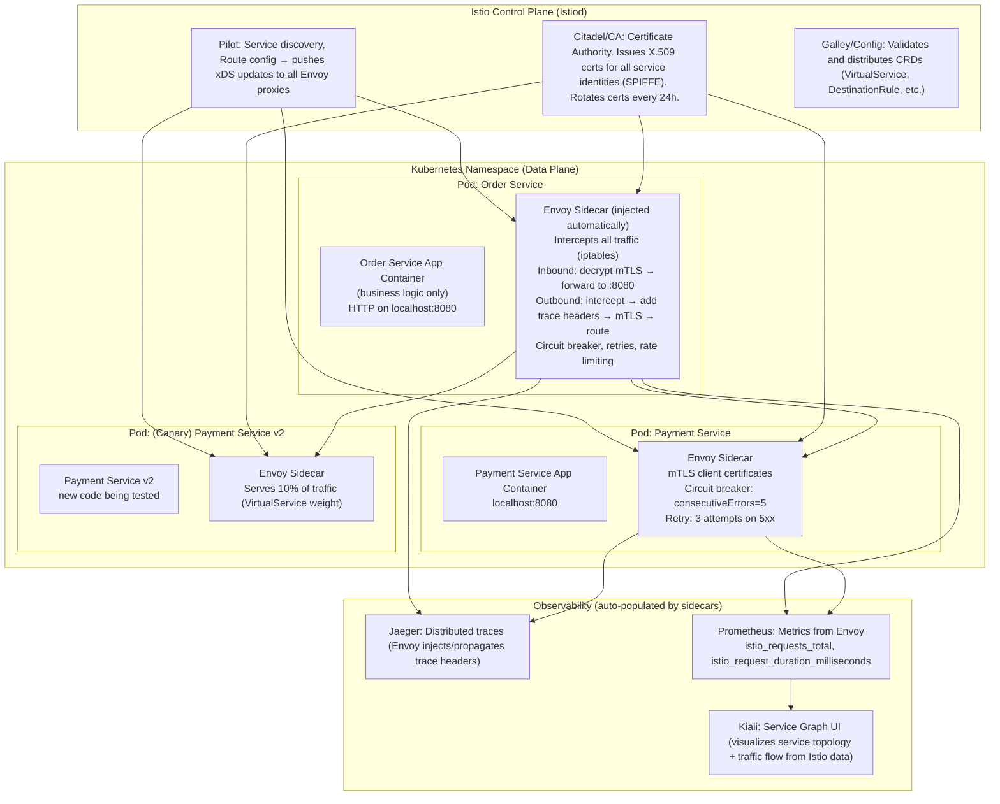
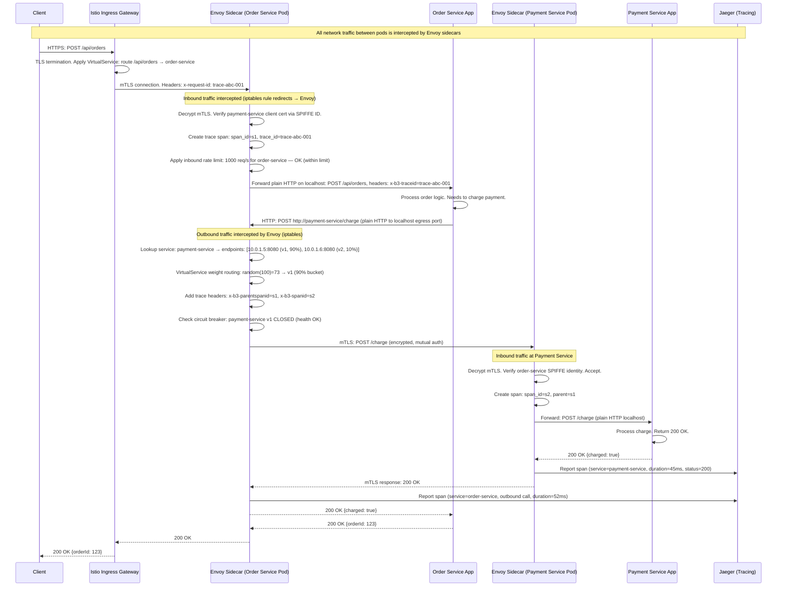
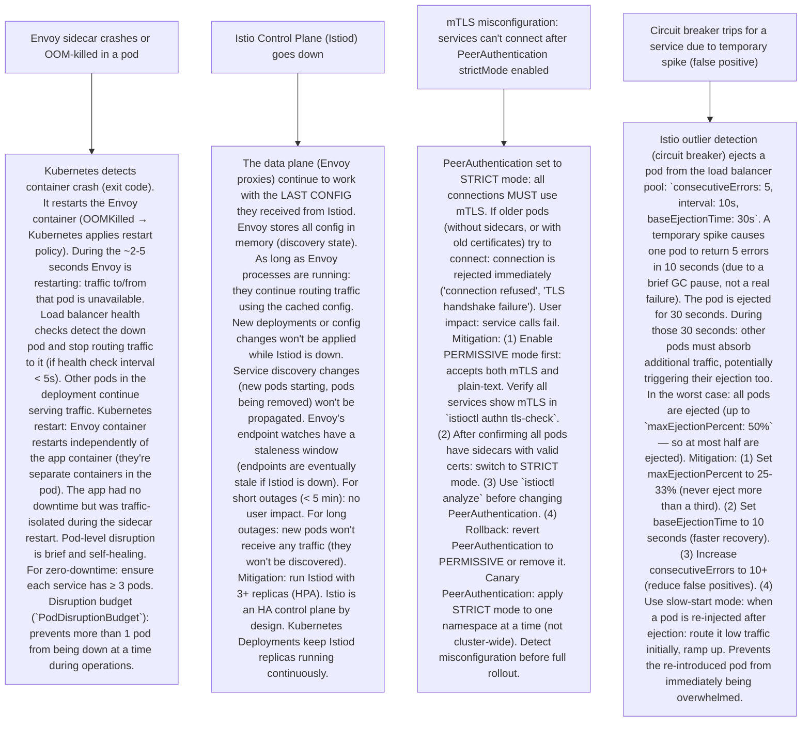

# P7 — Sidecar / Service Mesh (like Istio, Linkerd, Envoy, AWS App Mesh)

---

## ELI5 — What Is This?

> Imagine every worker in a large office building needs to: (1) lock their office door (mTLS security),
> (2) sign in/out of every meeting (distributed tracing), (3) report sick leave to HR (health checks),
> (4) follow traffic laws on certain floors (rate limiting, circuit breaking).
> If each worker had to learn all these rules and implement them personally:
> it would take months, every worker would do it differently, and new hires would be confused.
> Instead: the building management assigns each worker a PERSONAL ASSISTANT (the sidecar).
> The assistant handles all the administrative tasks for the worker.
> The worker just does their actual job (business logic).
> Every assistant across all workers runs the same software (Envoy Proxy).
> A central management office (Istio Control Plane) pushes policies to all assistants at once.
> This is the Sidecar Pattern and Service Mesh.
> The sidecar (Envoy) runs as a separate container alongside every microservice pod in Kubernetes.
> It handles: mTLS, distributed tracing, circuit breaking, retries, rate limiting, traffic splitting.
> No code changes to the microservices themselves. Infrastructure handles cross-cutting concerns.

---

## Glossary (Every Keyword Explained in ELI5)

| Word | ELI5 Meaning |
|---|---|
| **Sidecar Pattern** | A design pattern where a helper container runs alongside the main application container in the same Pod (Kubernetes) or on the same host. The sidecar handles infrastructure concerns independently of the main app. The main app and sidecar are deployed, scaled, and restarted together — but their code is independent. |
| **Service Mesh** | An infrastructure layer that manages all service-to-service communication in a microservices architecture. Implemented via sidecars (Envoy proxies) on every service + a control plane that configures them. Provides: discovery, load balancing, mTLS, circuit breaking, retries, observability, traffic management. |
| **Envoy Proxy** | High-performance, C++ Layer 7 proxy (created by Lyft, 2016, open-sourced). The standard sidecar implementation for Istio, AWS App Mesh, and other service meshes. Handles all inbound/outbound traffic for a pod. Pluggable: load balancing algorithms, filters, tracing backends. |
| **Istio** | A service mesh control plane (Google + Lyft + IBM, 2017). Runs as Kubernetes controllers. Manages Envoy sidecars via xDS APIs (discovery service). Provides CRDs: VirtualService (traffic routing), DestinationRule (load balancing + circuit breaking), PeerAuthentication (mTLS policy). |
| **Control Plane** | The centralized configuration management layer of a service mesh. (Istio: Pilot/Istiod, Linkerd: Destination, Consul: Server agents). Manages service discovery, pushes routing/policy config to all sidecar proxies via gRPC streaming. Data plane (Envoy) reads config from control plane in real-time. |
| **Data Plane** | The actual layer that routes traffic — the Envoy sidecar proxies. Handles every byte of network traffic between services. Config comes from the control plane. Envoy applies circuit breakers, retries, timeouts, and mTLS without the application knowing. |
| **mTLS (Mutual TLS)** | Both client AND server authenticate each other with X.509 certificates. In a service mesh: Envoy automatically establishes mTLS for all pod-to-pod communication. The application code uses plain HTTP internally. The sidecar wraps it in mTLS automatically. Certificate rotation happens without restarting apps. Prevents attacker inside the cluster from intercepting or spoofing service identity. |
| **xDS API** | "Discovery Service" API — the standard gRPC protocol Envoy uses to receive configuration from the control plane. xDS = umbrella term: EDS (Endpoint Discovery), CDS (Cluster Discovery), RDS (Route Discovery), LDS (Listener Discovery). Envoy receives dynamic config updates in real-time without restart. Istio Pilot implements xDS API to push updates to all Envoy sidecars. |
| **VirtualService (Istio)** | Kubernetes CRD that configures how traffic is routed to a service. Supports: weight-based routing (10% to v2, 90% to v1), header-based routing (route to canary if `x-user-type: beta`), fault injection (introduce 5% errors for testing), retries, timeouts. |
| **DestinationRule (Istio)** | Kubernetes CRD that configures what happens when traffic reaches a service: load balancing algorithm, circuit breaker (outlier detection), connection pool size, subsets (pods labeled v1 vs v2). Works with VirtualService: VirtualService says "where to send traffic", DestinationRule says "how to behave when talking to that service." |
| **Distributed Tracing** | A technique for tracking a single request across multiple microservices. Each service adds a "span" to the trace. The Envoy sidecar automatically injects trace headers (B3, W3C Trace Context) and reports spans to a tracing backend (Jaeger, Zipkin, AWS X-Ray). Developers see the complete request journey (which services were called, how long each took, where errors occurred). |

---

## Component Diagram

---

## Step-by-Step Request Flow

---

## Bottlenecks — Every Point Explained

| # | Bottleneck | Why It Hurts | Fix |
|---|---|---|---|
| 1 | **Sidecar proxy latency overhead** | Every service-to-service call goes through TWO Envoy proxies (outgoing sidecar + incoming sidecar). Each Envoy adds ~0.5–2ms of latency per call (encryption, routing logic, tracing). For a request chain with 5 service hops: up to 10 Envoy hops = 5–20ms of pure proxy overhead. For latency-sensitive microservices (< 5ms SLA): this is significant. High-frequency internal calls (health checks, cache lookups every 10ms): proxy overhead is proportionally large. | Topology optimization: combine services that call each other extremely frequently into a single service (avoiding the mesh overhead). For ultra-low latency: use gRPC with client-side load balancing (bypasses the sidecar for specific calls). Envoy performance: tune Envoy's worker thread count (`concurrency`) to match CPU cores. Use Unix domain sockets for loopback communication (avoids TCP stack overhead). Envoy is already very fast (C++ with Nginx-inspired performance). For most workloads (P99 < 50ms SLA): 1-2ms Envoy overhead is acceptable and the operational benefits outweigh the cost. Benchmark before optimizing. |
| 2 | **Control plane scalability (Istiod under many services)** | Istio's Istiod must push config updates to every Envoy proxy in the cluster. In a cluster with 5000 pods: a single DestinationRule or VirtualService change triggers 5000 xDS pushes. If these are full config dumps (not incremental updates): each push is large. Mass xDS pushes cause CPU spikes on Istiod and network bursts. Istiod becomes a bottleneck for config convergence time. | Delta xDS (incremental xDS): Istio 1.11+ supports delta xDS — only changed config is pushed (not full state). Dramatically reduces push size for large clusters. Namespace isolation: limit the blast radius of config pushes using Sidecar CRDs (`spec.egress` restrictions). Each service only gets the config for services it actually calls (not the entire cluster config). Horizontal scaling: Istiod can be scaled to multiple replicas. Mesh expansion: for very large clusters (10K+ pods): consider a multi-cluster or multi-mesh topology. Benchmark xDS push latency as cluster grows. |
| 3 | **mTLS certificate management complexity** | Every service needs a TLS certificate. In a large cluster: thousands of certificates. Certificates expire (default: 24 hours in Istio). SPIRE/Citadel issues certs and rotates them. If cert rotation fails: services can't establish mTLS connections → communication failures. Debugging mTLS failures ("connection refused", "certificate verify failed") requires Envoy debug config. Cert-related failures are notoriously hard to diagnose without tooling. | Istio abstracts cert management: developers don't manage certificates manually. Citadel (Istiod's CA) automatically issues and rotates certificates. `istioctl analyze` detects mTLS configuration mismatches. `istioctl authn tls-check` shows mTLS status between service pairs. Debugging tools: `istioctl proxy-config` shows live Envoy config for a pod. For cert rotation failures: monitor Istiod cert issuance success rate (Prometheus metric: `citadel_server_csr_count`). Alert on cert rotation failures. Use `VERIFY_CERTIFICATE_AT_CLIENT` in PeerAuthentication to enforce mTLS (reject plain-text connections). |
| 4 | **Misrouted traffic (VirtualService not applied)** | A developer deploys a VirtualService for canary routing (10% to v2). But forgets to create the DestinationRule with subsets defined for v1/v2. Without the subsets: Istio cannot route by version. All traffic goes to v1 (ignoring the VirtualService weight). The developer sees the canary deployment but metrics show 0% traffic to v2. No error is visible — traffic silently falls back to default routing. | `istioctl analyze` MUST be run before applying Istio config changes. It detects: missing DestinationRule subsets, misconfigured VirtualServices, orphaned routes, conflicting policies. Use GitOps (ArgoCD) for Istio config: VirtualService and DestinationRule changes go through CI with automatic `istioctl analyze` step. Kiali UI: visualizes live traffic distribution. If VirtualService weight=10% to v2 but Kiali shows 0% → misconfiguration detected. Admission webhooks: install a custom admission webhook that validates Istio CRDs on every `kubectl apply` (rejects invalid config before it reaches the cluster). |

---

## What Happens When Each Part Fails?

---

## Key Numbers to Know

| Metric | Value |
|---|---|
| Envoy proxy latency overhead (per hop) | 0.5–2ms (P99) |
| Envoy proxy memory overhead per pod | 50–100 MB |
| Istio cert rotation interval | 24 hours (default) |
| TLS cert lifetime (Istio Citadel) | 90 days (rotated every 24h) |
| Max pods per Istiod instance | ~1000 (beyond that: scale Istiod) |
| xDS config convergence time (small cluster) | < 1 second |
| Envoy circuit breaker: consecutive errors default | 5 errors → eject for 30s |
| Distributed trace overhead (Envoy → Jaeger) | < 0.1ms |
| gRPC-based xDS updates (delta) | Per-resource incremental pushes |
| Linkerd sidecar memory (ultralight) | 10–20 MB per pod (vs Envoy 50–100 MB) |

---

## How All Components Work Together (The Full Story)

Before service meshes: every microservice team had to implement TLS, retries, circuit breaking, and distributed tracing themselves (using libraries like Hystrix, Zipkin clients). Teams chose different libraries, different versions, different configurations. The result was inconsistent resilience across services, hard-to-trace failures.

**The service mesh insight:** all of these cross-cutting concerns are not business logic. They're **infrastructure concerns** that belong in the infrastructure layer — not in application code. Move them to the sidecar.

**How the sidecar works transparently:** Kubernetes Init Container (running before the app starts) configures iptables rules in the pod. ALL ingress and egress TCP traffic is redirected through the Envoy sidecar (port 15001 for outbound, 15006 for inbound). The application code doesn't know about Envoy. When the app does `http.get("http://payment-service/charge")`: the request goes to port 80 > iptables intercepts > redirects to Envoy:15001. Envoy looks up the destination in the registry, applies TLS, retries, and circuit breaking, then connects to the target pod via mTLS. Completely transparent to the app.

**Control plane + data plane:** Istiod watches Kubernetes API (pods, services, endpoints) and computes routing tables. It pushes these to all Envoy sidecars via gRPC streaming (xDS protocol). When you apply a new VirtualService YAML: Istiod processes it in < 1 second and pushes the updated routing config to the relevant Envoy proxies. The proxies start applying the new routing rule immediately — without restart.

> **ELI5 Summary:** Service mesh is the "operating system for microservices." Each service (the app) just does its job. The OS (sidecar + control plane) handles the rest: secure communications, traffic rules, health checks, observability. Just as an app doesn't write its own device drivers — it uses the OS. Microservices don't write their own TLS, circuit breakers, and tracing — they use the service mesh.

---

## Key Trade-offs

| Decision | Option A | Option B | Why |
|---|---|---|---|
| **Istio vs Linkerd** | Istio: feature-rich (traffic splitting, fault injection, JWT auth, WASM plugins). Higher operational complexity (~10 CRD types). Envoy sidecar: 50-100MB per pod. Large community, broad feature set. Used at eBay, T-Mobile, Tesla. | Linkerd: focused, minimal. Ultra-lightweight "microproxy" written in Rust: 10-20 MB. Simpler configuration (fewer CRDs). Easier to onboard. Less feature-rich (no fault injection, limited external auth). | **Linkerd for simplicity and low overhead in resource-constrained environments** (many pods, limited node memory). **Istio for full feature set** (complex traffic management, zero-trust security, external auth policies). For most new projects: start with Linkerd's simplicity. Migrate to Istio if you need advanced features (canary with header routing, WASM extensibility). |
| **Sidecar injection: opt-in vs namespace-wide** | Opt-in: annotate specific pods to get sidecars. Most pods don't have them. Low overhead. But: services without sidecars don't benefit from mTLS or mesh policies. You have a partial mesh. | Namespace-wide injection: all pods in the namespace automatically get sidecars (via MutatingAdmissionWebhook). Full mesh coverage. Higher overhead. Some system pods (database pods, system components) may not need sidecars. | **Namespace-wide injection for production application namespaces.** System namespaces (kube-system, database namespaces): opt-out (`sidecar.istio.io/inject: "false"` annotation). Consistent mesh coverage across your application tier. Databases and external services are reachable from pods WITH sidecars but don't run sidecars themselves — Istio handles this with ServiceEntry CRDs (defines how to reach non-mesh services). |
| **Service mesh vs application-level libraries (Resilience4j, OpenTelemetry SDK)** | Application libraries: language-specific, code-level control. Full access to business context for fallback logic. Higher portability (no infrastructure dependency). Must be maintained per service, per language. | Service mesh: infrastructure-level, language-agnostic. No code changes. But: limited fallback (can only return 503, not custom responses). Less business context available at the sidecar level. | **Use both layers for complementary concerns**: Service mesh for infrastructure-level resilience (global policies, mTLS, basic circuit breaking, standard retries). Application libraries for business-logic resilience (custom fallback responses, context-aware retry strategies, exception-type-specific handling). Avoid duplicating the same concern at both layers (e.g., Resilience4j circuit breaker AND Istio outlier detection for the same service → double-tripping, inconsistent states). Assign ownership clearly: infrastructure team manages Istio. Application team manages Resilience4j. |

---

## Important Cross Questions

**Q1. How does Istio inject Envoy sidecar automatically without modifying application deployments?**
> Istio uses a Kubernetes MutatingAdmissionWebhook. When a pod creation request arrives at the Kubernetes API server: Kubernetes calls Istio's webhook with the pod spec. Istio's webhook (running as a Service in `istio-system` namespace) inspects the pod. If the pod is in a namespace labeled `istio-injection: enabled` AND the pod doesn't have `sidecar.istio.io/inject: "false"`: the webhook mutates the pod spec before it's created. Mutation: (1) Adds `istio-proxy` (Envoy) container to the pod spec. (2) Adds `istio-init` init-container (runs before app to set up iptables rules). (3) Mounts the service account certificate and Envoy bootstrap config. The developer's original Deployment YAML is unchanged. Every pod CREATED in the namespace gets a sidecar. The Init Container runs `iptables -t nat -A OUTPUT -p tcp --dport 80 -j REDIRECT --to-port 15001` (simplified) to redirect traffic through Envoy.

**Q2. How does Envoy implement distributed tracing transparently?**
> Envoy generates and propagates distributed trace context headers on every request it proxies. Context headers: B3 format (Zipkin): `X-B3-TraceId`, `X-B3-SpanId`, `X-B3-ParentSpanId`, `X-B3-Sampled`. W3C Trace Context: `traceparent`, `tracestate`. When Envoy receives an inbound request: if no trace headers exist, it generates a new TraceId. It creates a "span" representing the call. When Envoy makes an outbound call on behalf of the app: it injects the trace headers with the current TraceId + new SpanId. The downstream Envoy receives these headers and creates a child span. Important caveat: application code MUST pass through trace headers it receives to outbound calls it makes. If `OrderService` app receives a request with `X-B3-TraceId: abc` but doesn't pass that header when calling `PaymentService` internally: Envoy sees a call with no header → generates a NEW TraceId. The trace is broken — Order and Payment appear as separate traces in Jaeger. This is the one thing developers MUST do: propagate trace headers. OpenTelemetry SDK automates this in most frameworks (Spring, FastAPI, Express).

**Q3. What is the difference between VirtualService and DestinationRule in Istio?**
> VirtualService: defines HOW traffic is routed to a service. "When a request matches criterion X, send Y% to subset v1, Z% to subset v2." It's the routing table. VirtualService matches on: host, URI, HTTP headers, HTTP methods, gRPC service name. Supports: weighted routing, fault injection, retries, timeouts, mirror (shadow traffic), redirect/rewrite. DestinationRule: defines behaviors FOR traffic arriving at a service's subset. "For subset v1: use round-robin load balancing. If 5 consecutive errors: eject pod for 30s. Max 100 concurrent connections." It configures: load balancing algorithm (ROUND_ROBIN, LEAST_CONN, RANDOM), circuit breaker (outlier detection), connection pool settings, TLS mode. They work together: VirtualService routes 10% of traffic to subset "v2". DestinationRule defines which pods are in subnet "v2" (pods with label `version: v2`) and what load balancing/circuit breaker applies to v2. Without both: canary deployment doesn't work (VirtualService has no subsets to route to if DestinationRule doesn't define them).

**Q4. How does Istio enforce zero-trust security (mTLS + authorization policies)?**
> Zero-trust: "never trust, always verify." Every request must be authenticated and authorized, even if it comes from inside the cluster. Istio implements this via: (1) Automatic mTLS: Citadel issues SPIFFE/SVID X.509 certificates to every pod. Identity = `spiffe://cluster.local/ns/default/sa/orders-service`. All pod-to-pod traffic is mTLS (both sides present certs). A compromised pod inside the cluster cannot impersonate another service (no cert = no connection). (2) AuthorizationPolicy: Kubernetes CRD that controls which services can call which services. `AuthorizationPolicy: allow source.principal = orders-service to call payment-service on port 8080 via POST /charge`. Everything else denied. Network perimeter security (firewall) is insufficient for microservices (all pods share the same VPC). AuthorizationPolicy + mTLS provides service-level micro-segmentation. (3) Cert rotation: certificates expire (24 hours). Envoy automatically renews. A compromised cert is only valid until the next rotation. This limits the blast radius of a cert theft.

**Q5. When should you NOT use a service mesh?**
> Service meshes add operational complexity. Avoid when: (1) Small number of services (< 5–10): the operational overhead of Istio (CRDs to learn, certificates to manage, control plane to maintain) outweighs benefits. Use application-level libraries (Resilience4j, OpenTelemetry) instead. (2) Non-Kubernetes environments: service meshes are designed for Kubernetes. Migrating to a service mesh requires Kubernetes. If you're running VMs or bare metal: Consul Connect works, but complexity is even higher. (3) Stateful workloads (databases): database pods should NOT have sidecars. The traffic interception and mTLS overhead are not appropriate for high-throughput binary protocols (MySQL wire protocol, PostgreSQL wire protocol). Use `sidecar.istio.io/inject: "false"` on database StatefulSets. (4) Ultra-low latency requirements (< 1ms P99): Envoy's 0.5–2ms overhead per hop is unacceptable. Use gRPC with client-side load balancing directly. (5) Immature team: if the team is still learning Kubernetes basics, adding a service mesh before mastering deployments, ConfigMaps, and RBAC creates too much cognitive load. Walk before running.

**Q6. How does a service mesh handle traffic to external services (databases, third-party APIs)?**
> External services (DBs, Stripe API, external SaaS) don't have Envoy sidecars. To integrate them into the mesh: Istio's `ServiceEntry` CRD registers external services in the mesh registry. `ServiceEntry: stripe.com, port 443, EXTERNAL`. Once registered: Envoy knows about this service and can apply mesh policies (mTLS to Stripe is done at the Envoy level using Stripe's server TLS cert). Without ServiceEntry: Envoy allows all egress traffic by default (in permissive mode) or blocks all egress (in strict egress mode). For security: use strict egress mode and explicitly whitelist external services via ServiceEntry. This prevents a compromised pod from calling arbitrary external endpoints. For databases: create a ServiceEntry for the DB host. Configure TLS origination in DestinationRule (Envoy initiates TLS to the DB, app uses plain text on localhost). The mesh handles TLS for DB connections transparently.

---

## Real-World Apps That Use This Pattern

| Company | Product | How They Use It |
|---|---|---|
| **Lyft** | Ride-Sharing Platform | Created Envoy (2016, open-sourced 2016). Lyft's service mesh (using Envoy) was the foundation for Istio's data plane. Envoy handles all service-to-service traffic at Lyft (100K+ RPS). Features: gRPC load balancing, distributed tracing (Zipkin), circuit breaking. Lyft uses custom Envoy filters for business-specific features (driver matching, surge pricing rate limiting). |
| **eBay** | E-Commerce Platform | eBay runs one of the largest Istio deployments in production. 50K+ services, multiple Kubernetes clusters. eBay uses Istio for traffic management, mTLS, and observability. Their platform team maintains an internal service mesh control plane based on Istio. Published engineering blog posts on scaling Istio control plane at 50K service scale. |
| **Google / GCP** | Traffic Director | Google's internal service mesh (Google Service Infrastructure) uses Envoy-based proxy infrastructure. Traffic Director: Google Cloud's fully managed control plane for Envoy proxies across Compute Engine VMs, GKE pods, and Cloud Run. Implements Istio's xDS API. Google runs the world's largest internal service mesh (Google.com infrastructure). |
| **AWS** | App Mesh + ECS / EKS | AWS App Mesh: managed Envoy-based service mesh for AWS environments. Integrates with ECS, EKS, EC2. App Mesh manages Envoy configuration via AWS APIs (not K8s CRDs). Used by Amazon.com internal teams for traffic management and observability. AWS recently released Amazon VPC Lattice as a higher-level alternative to App Mesh for simpler use cases. |
| **Airbnb** | Internal Platform | Airbnb uses Envoy as their service networking backbone with a custom control plane. Their "SOA Platform" provides service discovery, circuit breaking, and distributed tracing built on Envoy. Airbnb contributed to Envoy development and the CNCF ecosystem. Their custom control plane integrates with their deployment pipeline (Spinnaker) for traffic splitting during canary deployments. |
