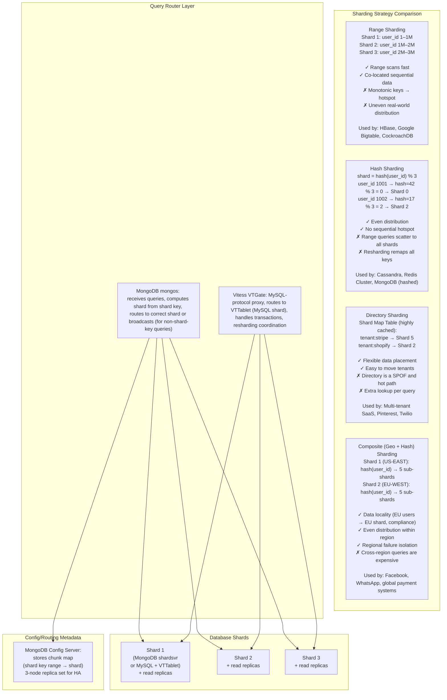
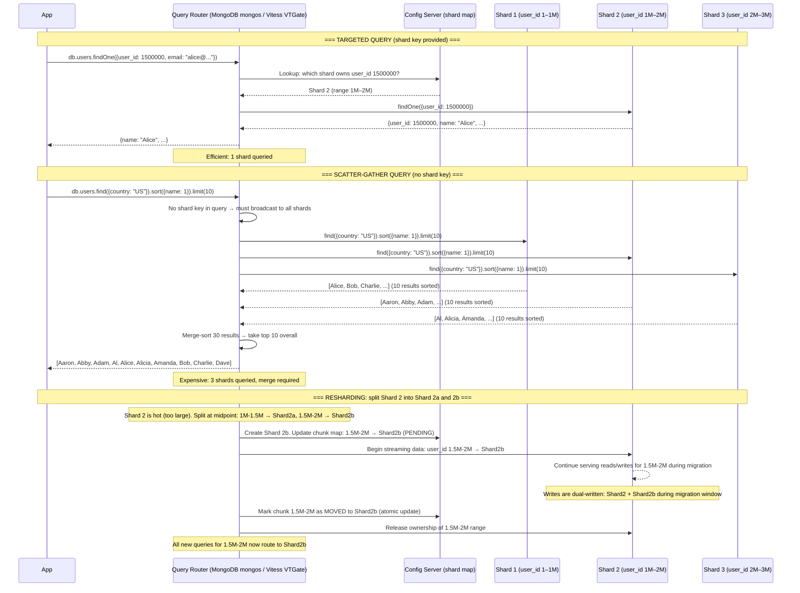
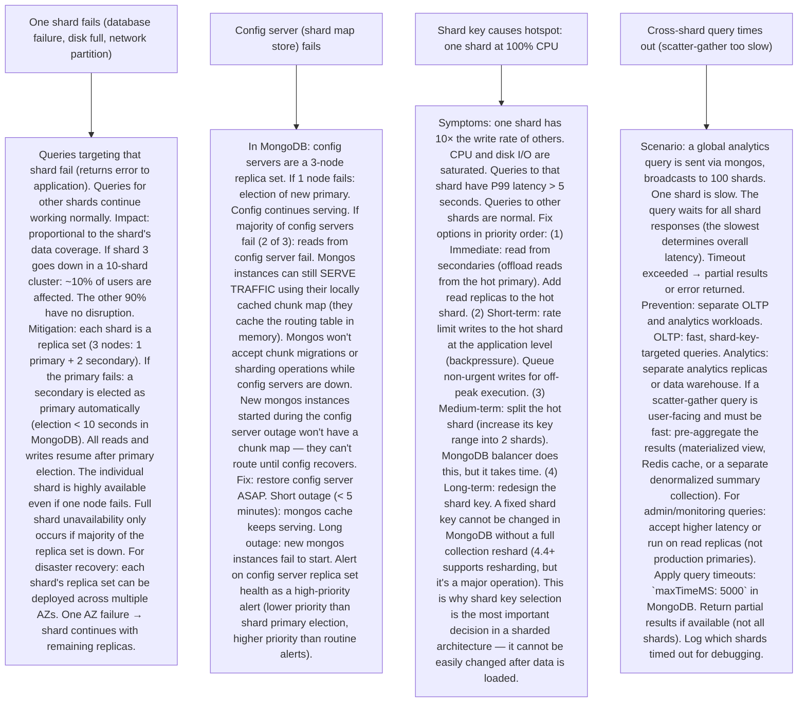

# P8 — Sharding Strategies (like MongoDB, Cassandra, YouTube Vitess, Stripe)

---

## ELI5 — What Is This?

> Imagine a library with 10 million books.
> One librarian (one database server) can't find every book fast enough —
> there are too many books in one place.
> Sharding is like splitting the library across 10 buildings:
> Building 1 has books A-C, Building 2 has books D-F, ... Building 10 has books X-Z.
> Now finding "War and Peace" (starts with W): go directly to building 10.
> This is range-based sharding.
> Or you could randomly assign books: every 10th book goes to building 1,
> every other 10th to building 2. Balanced load across buildings.
> This is hash-based sharding.
> The challenge: what if everyone suddenly wants biography books (hot building)?
> What if you need a 11th building (resharding)?
> What if a book spans two buildings (cross-shard query)?
> Sharding strategies decide HOW to split data across database nodes to achieve
> horizontal scalability with manageable trade-offs.
> Used by MongoDB, Cassandra, YouTube's Vitess (MySQL), Stripe, and every large-scale DB.

---

## Glossary (Every Keyword Explained in ELI5)

| Word | ELI5 Meaning |
|---|---|
| **Shard** | An individual database partition (one "slice" of the total data). Each shard is an independent database server (or replica set) that stores a subset of the data. Queries for data on shard 3 go only to shard 3 (not to all shards). |
| **Shard Key** | The column (or combination of columns) used to determine which shard stores a given row. The shard key decision is the most important design choice in a sharded architecture. A bad shard key → hot shards, uneven distribution, or expensive cross-shard queries. |
| **Range-Based Sharding** | Data is partitioned by shard key range: Shard 1 = user_id 1–1,000,000, Shard 2 = user_id 1,000,001–2,000,000. Range scans (get all users with ID 1-100) are efficient: they hit only one shard. Risk: monotonically increasing keys (timestamps, auto-increment IDs) cause all new inserts to go to the last shard (hotspot). |
| **Hash-Based Sharding** | `shard = hash(shard_key) % N`. Each row goes to the shard determined by the hash of its key. Distributes data evenly. Eliminates sequential hotspots. Disadvantage: range queries require hitting ALL shards (scatter-gather). Resharding (changing N) remaps ~(N-1)/N of all keys (see Consistent Hashing, P2, for improvements). |
| **Directory-Based Sharding** | A lookup table (shard map) explicitly maps entities to shards: `user_id 100 → Shard 3`. Flexibility: can move data between shards without changing the hash algorithm. Expensive: every query must first look up the directory (extra hop). The directory itself must be highly available and fast (cached). |
| **Hotspot** | A shard that receives disproportionately more reads or writes than others. Causes: extreme popularity of a few entities (viral post, celebrity user), sequential shard key (all new writes to shard N), or business seasonality. Results in one shard running hot while others are idle. |
| **Scatter-Gather** | A query pattern that must be sent to ALL shards (because the query doesn't include the shard key, or the operation spans multiple shards). Each shard returns partial results. The query coordinator merges and sorts results. Expensive: N shards × query execution time. |
| **Resharding** | Adding or removing shards. In hash-based sharding: changes N → must remap data to new shards (significant data movement). In consistent hashing: only 1/N data moves. In range sharding: split a hot shard's key range into two shards. Resharding requires careful orchestration (consistent reads during migration). |
| **Cross-Shard Transaction** | A transaction that modifies data on multiple shards. Standard ACID transactions only work within a single database. Cross-shard transactions require distributed transaction protocols (2PC) or Saga Pattern. Many sharded systems avoid cross-shard transactions by design (shard key ensures related data is co-located). |
| **Vitess** | YouTube/Google's MySQL sharding layer (open-sourced). Provides transparent sharding on top of MySQL: apps talk to Vitess (via MySQL protocol) and Vitess routes queries to the correct MySQL shard. Handles resharding, query routing, schema changes, failover. Used by YouTube, Slack, GitHub, Square. |

---

## Component Diagram

---

## Step-by-Step Request Flow

---

## Bottlenecks — Every Point Explained

| # | Bottleneck | Why It Hurts | Fix |
|---|---|---|---|
| 1 | **Hot shard (unbalanced load)** | With range sharding on `created_at` (timestamp): all new writes go to the last shard (current time range). E.g., `Shard 3` handles all writes from "today." 1000 writes/second to Shard 3, 0 writes/second to Shards 1 and 2. Shard 3 CPU is at 100%, others at 5%. Adding more capacity to Shard 3 helps temporarily but doesn't redistribute writes. Eventually Shard 3 must be split — but its key range grows daily. | Change shard key: if writes are by time: shard on a compound key (e.g., `{region, created_at}`) or use bucket sharding (`{bucket = hash(user_id) % 32, created_at}`). Each write distributes across 32 buckets. Or: use hash sharding on entity ID (user_id, order_id) instead of timestamp. Application-level: pre-shard write hot paths. For celebrity keys (1 user with 10M orders): scatter their writes using a shard key suffix (`user_id + random(0-9)` → 10 shards for that user's data). Aggregate at read time. |
| 2 | **Cross-shard queries require scatter-gather** | A query without the shard key must go to ALL shards. For an e-commerce `ORDER BY purchase_amount DESC LIMIT 10` (no user_id filter): all N shards are queried in parallel. Each shard sorts and returns 10 results. The router merges N×10 results and returns the top 10. N=100 shards: 100 parallel queries + merge of 1000 results. If one shard is slow (or down): the entire query waits. This is "tail latency amplification" — the overall latency is MAX(latency of all shards), not the average. | Denormalize for common access patterns: maintain a summary table/index in one place for frequently-needed global queries. For "top spenders leaderboard": run a batch job to aggregate across all shards and store results in a single shared view (Redis sorted set). Avoid scatter-gather at query time. Alternatively: separate analytics systems (Redshift, BigQuery) for cross-shard analytical queries. OLTP shards serve fast per-shard queries. OLAP systems serve global aggregations. Accept scatter-gather ONLY for rare admin queries, not for frequent user-facing queries. |
| 3 | **Resharding downtime and data migration** | When a shard grows too large (or is too hot): it must be split. During the split: data is being migrated from the old shard to the new shard. Migrating while serving live traffic requires careful coordination: dual-writes during migration, atomic handoff of routing config. If resharding is not designed carefully: data loss (some writes go to old shard after cutover) or duplicate data (some writes go to both shards). MongoDB's chunk migration happens continuously in the background — but still has a brief "commit" phase where the chunk is locked. Under very high write rates: the migration commit phase blocks writes for hundreds of milliseconds. | Auto-sharding (MongoDB, Casandra): the database handles chunk splits and migrations automatically. The balancer runs in the background. No manual resharding in most cases. For Vitess: planned resharding with VTCtl tools. Consistent hashing (P2) minimizes data movement during node additions (only 1/N keys move, vs all keys in modular hash). Design for resharding upfront: plan initial shard count to avoid early resharding. If you expect 10× growth: over-shard initially (more shards than needed). Shard merging is easier than shard splitting. |
| 4 | **Multi-shard transactions are difficult** | A checkout operation: (1) Deduct inventory (item owned by Shard 2) AND (2) Create order (user owned by Shard 5). Normally: one DB transaction. With sharding: two different databases. Standard 2PC: locks both shards during prepare phase. At high throughput: frequent cross-shard transactions cause locking contention and increased latency. Or: implement as a Saga (compensating transactions) at higher complexity. | Co-locate related data: design shard key so that entities that are frequently modified together are on the same shard. Key pattern: User + their Orders on the same shard (shard_key = user_id for both users and orders tables). An order is placed → user and order are on the same shard → single-shard transaction. "Entity group" sharding: all data for one customer (user profile, orders, addresses, payment methods) on one shard. Cross-entity transactions (inventory on one shard, order on another) → use Saga (P3) instead of 2PC. Acknowledge the trade-off: choose a shard key that eliminates the most important cross-shard transactions. Some cross-shard operations are unavoidable — handle with Saga or compensating logic. |
| 5 | **Shard routing layer becomes a bottleneck or SPOF** | All queries pass through the MongoDB mongos or Vitess VTGate (query router). If the router is a single node: it's a bottleneck and SPOF. At 100K queries/second: the router must be able to route 100K req/s (routing is fast: O(1) hash lookup, but still CPU-bound at very high throughput). | Deploy multiple router instances: MongoDB mongos: deploy multiple mongos instances. Clients connect to any mongos (load-balanced). No state is stored in mongos (all routing data from config servers). Scale horizontally by adding mongos replicas. Vitess VTGate: deploy multiple VTGate instances. Clients use round-robin or service discovery to distribute connections. VTGate is stateless (routing config from VTCtl). Application-level routing: for hash sharding, the routing logic is just `hash(key) % N`. Compute it IN THE APPLICATION (skip the routing layer). The application connects directly to the correct shard. No extra network hop. Works for simple hash routing. Doesn't work for range routing (need to consult config server for current chunk map). |

---

## What Happens When Each Part Fails?

---

## Key Numbers to Know

| Metric | Value |
|---|---|
| MongoDB default chunk size | 128 MB (auto-splits when exceeded) |
| MongoDB max shard key candidates | Must be indexed; compound allowed |
| Vitess VTTablet (MySQL shard) max recommended size | 250 GB per shard (rule of thumb) |
| Cross-shard query overhead (N=10 scatter-gather) | ~10× vs single-shard query latency |
| Consistent hashing data moved on node add (P2) | ~1/N |
| Hash sharding data moved on node add (modular) | ~(N-1)/N ≈ all |
| Cassandra recommended shard (node) count | Start with 3, add nodes as data grows |
| Vitess users | YouTube (2M QPS), Slack, GitHub, Square |
| MongoDB max shards per cluster | 1000 |

---

## How All Components Work Together (The Full Story)

Sharding is the primary horizontal scaling strategy for relational and document databases. When a single database can't handle the throughput (writes/reads per second) or the data volume (TB/PB of data): sharding splits the dataset across multiple independent database nodes.

**Why sharding (instead of just adding more CPU/RAM)?**
Vertical scaling (bigger server) has diminishing returns and a physical limit. A single PostgreSQL database server handles ~50K-100K reads/second. Beyond that: response times degrade. More RAM helps temporarily (better caching) but doesn't increase write throughput. Write throughput is fundamentally bounded by single-machine disk and CPU. Sharding breaks this barrier by distributing writes across N machines. 10 shards × 50K writes/second = 500K aggregate write throughput.

**The shard key is everything:** The shard key determines data distribution. Uniform distribution = uniform load = good. Skewed distribution = hot shards = cascading failure. The shard key must be: (1) High cardinality (many distinct values — not just {US, EU} for 2 values). (2) Evenly distributed values. (3) Frequently used in queries (to avoid scatter-gather). (4) Immutable (shard key changes require data migration).

**Query router makes sharding transparent:** Applications don't know which shard their data is on. They connect to the router (mongos, VTGate). The router computes the correct shard using the chunk map or hash function. For MongoDB: the router contacts config servers for the chunk map (cached in memory). For Vitess: the VTGate has the routing logic built in.

> **ELI5 Summary:** Sharding is like having multiple bank tellers. Without sharding: one teller handles ALL customers (single DB). Everyone waits in one long queue. With sharding: 10 tellers, customers with last name A-C go to teller 1, D-F to teller 2 (range sharding). Or: every 10th customer to teller 1, every other 10th to teller 2 (hash sharding). More tellers = more throughput. The challenge: don't let one teller get all the VIP customers (hotspot).

---

## Key Trade-offs

| Decision | Option A | Option B | Why |
|---|---|---|---|
| **Range sharding vs hash sharding** | Range sharding: natural data locality. Range scans efficient (all orders for user A on shard X). Risk: monotonic keys cause hot last shard. Used for time-series or sequential access patterns. | Hash sharding: even write distribution. Eliminates sequential hotspots. Range scans scatter across shards (expensive). Used for point lookups (get user by ID). | **Choose based on access pattern**: (1) Primarily point lookups and random access: hash sharding. (2) Range scans and time-series: range sharding with a composite key to prevent hotspot (add a random prefix to the key). (3) Multi-tenancy: directory sharding (tenant → shard map). Real-world: Cassandra uses consistent hashing. MongoDB supports both. CockroachDB uses range sharding (sorted key ranges). Mix: range sharding within a partition (Cassandra: consistent hash for partition key, range for clustering key). |
| **Application-level sharding vs middleware sharding (Vitess/Citus) vs native sharding (MongoDB)** | Application-level: app code computes shard, connects directly. Full control, low overhead, no extra infrastructure. High complexity in app code. Schema changes require manual coordination per shard. | Middleware (Vitess, Citus): transparent sharding proxy. App uses standard MySQL/PostgreSQL driver. Middleware handles routing. Schema changes coordinated by Vitess/Citus. Higher operational complexity (separate control plane). | **Use native or middleware sharding** for greenfield systems. Application-level sharding is only warranted when extreme performance (no extra proxy hop) is required and the team is experienced. Vitess is proven at YouTube scale (2M QPS). MongoDB's auto-sharding handles chunk balancing. PostgreSQL + Citus for SQL purists. Choose based on team familiarity with the database technology. |
| **Many small shards (over-sharding) vs few large shards** | Many small shards (100+): easy resharding (split/merge smaller units). Better load distribution at scale. More operational complexity (100 replica sets to manage). More cross-shard queries if shard key has low selectivity. | Few large shards (3-10): simpler operations. Each shard is large — splitting is a bigger operation. Easier to start. Works well up to ~500M rows per shard (MongoDB). | **Start with fewer shards (3-10), design for growth.** Deliberately choose a shard key with high cardinality so future splits are natural. MongoDB auto-splits chunks — you don't pre-create hundreds of shards. For known huge-scale systems (100M+ users from day 1): over-shard upfront. Facebook preallocated 4096 logical shards for MySQL (mapped to fewer physical servers initially). Adding physical capacity: just move logical shards to new servers (no data rehashing). |

---

## Important Cross Questions

**Q1. What makes a good shard key? What are the anti-patterns?**
> Good shard key properties: (1) High cardinality: millions of distinct values (user_id: good; status (ACTIVE/INACTIVE): terrible — only 2 values = 2 shards max). (2) Even distribution: values are uniformly distributed. Auto-increment IDs with modular hash: even. Time-based IDs without hash: sequential hotspot. (3) Query alignment: the shard key must appear in most queries. If 90% of queries filter by `user_id`, use `user_id` as the shard key. If user_id is not in a query: scatter-gather. (4) Immutability: once a row is assigned to a shard (by its shard key value), the shard key should not change. Changing user_id would require moving the row to a different shard — operationally complex. Anti-patterns: (1) Low-cardinality key (status, country — only a few distinct values = only a few possible shards). (2) Monotonically increasing key without hash (auto-increment, timestamp — all new inserts hit the last shard). (3) Frequently queried without the shard key (forces scatter-gather for common queries). (4) Mutable key (changes require shard reassignment). MongoDB rejects updates to the shard key.

**Q2. How does Vitess handle MySQL sharding at YouTube scale?**
> YouTube needed to scale MySQL beyond what a single server could handle. Vitess was created (2010) to provide transparent sharding on top of MySQL. How it works: (1) VTGate: stateless query router. Apps connect via MySQL wire protocol. VTGate parses the SQL query, extracts the vindex (shard key) value, computes the target shard. (2) VTTablet: runs alongside each MySQL instance (sidecar pattern). Manages MySQL connections, query rewriting for shard routing, hot row protection. (3) VTCtl: management API. Handles planned failovers, resharding (horizontal resharding, vertical resharding), schema changes (long-running DDL is handled differently: OnlineDDL). (4) Horizontal resharding: takes a source shard, copies data to two destination shards, switches over. Handles writes during migration with catchup replication. (5) Topology: ZooKeeper or etcd stores cluster topology (which VTTablet is primary for each shard). Vitess is used at YouTube (2M QPS), Slack, GitHub, Square. It's now CNCF-graduated (v18.0). Planetscale is the hosted Vitess offering.

**Q3. What is "fat partition" or "write skew" in sharding?**
> Write skew: not all shard keys receive equal write volume in real-world data. Example: `user_id` is the shard key. Most users have 10 orders. But user_id=1 is the CEO with 10,000,000 orders (test account, system account). Hash(1) maps to Shard 3. Shard 3 is overwhelmed by this one user. Social media: celebrity user (100M followers) creates a post → millions of writes to a shard handling their data. This is the "fat partition" problem (also called "hot key" or "celebrity problem"). Solutions: (1) Scatter the write target: suffix the hot user's shard key with a random number (`user_id + "_" + random(0-9)`). Writes are distributed across 10 sub-shards. Reads aggregate from 10 sub-shards. (2) Separate the hot entity: handle celebrity users with a dedicated data store or cache (Redis) outside the shard. Pre-compute their data. (3) Rate limit the hot entity at the application level. (4) Application-level sharding awareness: detect hot keys and route differently (application-level circuit break + cache for hot keys).

**Q4. How do MongoDB's chunks and the balancer work?**
> MongoDB sharding uses "chunks" (contiguous ranges of the shard key space). Each chunk lives on one shard. Default chunk size: 128 MB. The balancer runs as a background process (on the primary config server) and monitors chunk distribution. If one shard has significantly more chunks than another: the balancer moves excess chunks. Moving a chunk: (1) MongoD initiates a chunk migration from source shard to destination shard. (2) Source streams all documents in the chunk to destination. (3) During streaming: source continues serving reads/writes for those documents. (4) Source sends a "commit" command to config server: atomically updates the chunk map (old shard: release, new shard: claim). (5) After commit: new queries for that chunk range go to the destination shard. (6) Source deletes the migrated documents (cleanup phase). The commit step is brief (milliseconds). The streaming step is longer but transparent. Balancer window: can be scheduled to run only during off-peak hours (avoid balancer during peak traffic). Chunk split: when a chunk grows > 128 MB: MongoDB auto-splits it at the median key value.

**Q5. How does CockroachDB handle sharding differently than MongoDB?**
> CockroachDB: distributed SQL database (Postgres-compatible). Uses range-based sharding (called "ranges") on a key-value store layer. Key differences from MongoDB: (1) Automatic sharding: tables are automatically split into ranges (default: 512 MB per range). No user configuration of shard key. CockroachDB decides ranges based on data size. (2) Consistent hashing at the range level: each range is assigned to 3 nodes (replicated). Ranges move between nodes as data grows (automatic rebalancing). (3) Full ACID transactions across ranges: CockroachDB implements distributed transactions natively using Hybrid Logical Clocks (HLC) and a multi-version concurrency control (MVCC) scheme. No need for Saga or 2PC frameworks. (4) SQL: CockroachDB is fully SQL-compliant. Range queries are efficient (ranges are sorted by primary key). (5) Global tables: CockroachDB supports "GLOBAL" tables that are replicated to all nodes (low-latency reads globally for reference data like countries, currencies). Philosophy: CockroachDB trades complexity for consistency (full ACID everywhere). MongoDB trades consistency for flexibility (schema-less, horizontal scale focus).

**Q6. What is "shard pruning" and why does it matter for query performance?**
> Shard pruning (also called "partition pruning" in PostgreSQL): when a query includes a filter on the shard key, the query planner can determine WHICH shards can possibly contain matching rows — and skip all others. Example: `WHERE user_id = 12345` → compute `hash(12345) % 10 = 3` → only query Shard 3. Shards 0-2, 4-9 are pruned (not queried). Even for range queries: `WHERE user_id BETWEEN 1000000 AND 2000000` → range sharding: only Shard 2 contains this range → Shards 1, 3 are pruned. Why it matters: without pruning, every query is a scatter-gather (all shards queried). With pruning: only relevant shards are queried → throughput = N× faster (N = number of pruned shards). Require shard key in hot path queries: design your application so that frequently-executed queries ALWAYS include the shard key in their `WHERE` clause. This is the primary design constraint of sharded systems. Evaluate all your top 10 query patterns before finalizing the shard key: can every query include the shard key (enable pruning) or do some require scatter-gather?

---

## Real-World Apps That Use This Pattern

| Company | Product | How They Use It |
|---|---|---|
| **YouTube / Google** | Video Metadata & Comments | YouTube created Vitess (2010) to scale MySQL sharding for video metadata (titles, descriptions, comment counts). Vitess handles 2M+ QPS across hundreds of MySQL shards. Resharding implemented via VTCtl without downtime. YouTube shards by video_id (high cardinality, evenly distributed UUID). Vitess was open-sourced (2012) and is now CNCF-graduated. Planetscale.com provides hosted Vitess. |
| **MongoDB** | Atlas Sharded Clusters | MongoDB's native sharding (mongos + config servers + shards) is used by thousands of customers. Automatic chunk balancing, range and hashed shard keys supported. MongoDB Atlas Sharded Clusters: managed sharding on cloud (AWS/GCP/Azure). Notable users: Adobe (user profiles, sharded by user_id), Foursquare (location data, sharded by geo hash), The Guardian (content metadata). |
| **Stripe** | Payment Processing | Stripe uses sharding (internal MySQL-based) to distribute payment records across shards. Shard key: customer_id (ensures all of a customer's charges, subscriptions, and invoices are co-located on one shard, enabling single-shard transactions for per-customer operations). Resharding has been documented in Stripe's engineering blog. Stripe also uses Vitess for some workloads. |
| **Pinterest** | Content & User Data | Pinterest uses a combination of directory-based sharding (tenant/user → shard map stored in ZooKeeper) and hash sharding for different data types. Pinterest engineering blog: "Sharding Pinterest: How We Scale Our MySQL Fleet" describes their approach. User data: sharded by user_id (all of a user's boards, pins, follows on one shard for efficient per-user queries). |
| **Cassandra Users (Netflix, Apple)** | Distributed Wide-Column Store | Apache Cassandra uses consistent hashing (P2) as its sharding strategy. No configuration needed: add a node → Cassandra rebalances automatically. Netflix (100TB+ production on Cassandra, user watch history, streaming state). Apple (iCloud, 300K+ Cassandra nodes at peak). Shard key in Cassandra = partition key. All rows with the same partition key are on the same node (co-located), enabling efficient partition-level range scans on clustering columns. |
