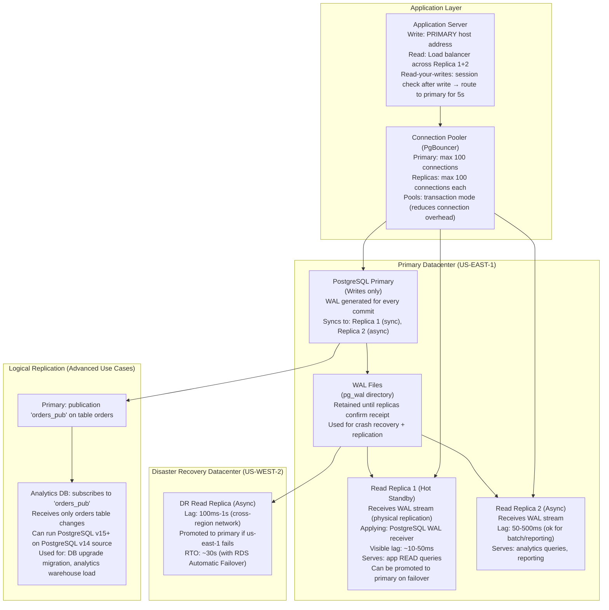
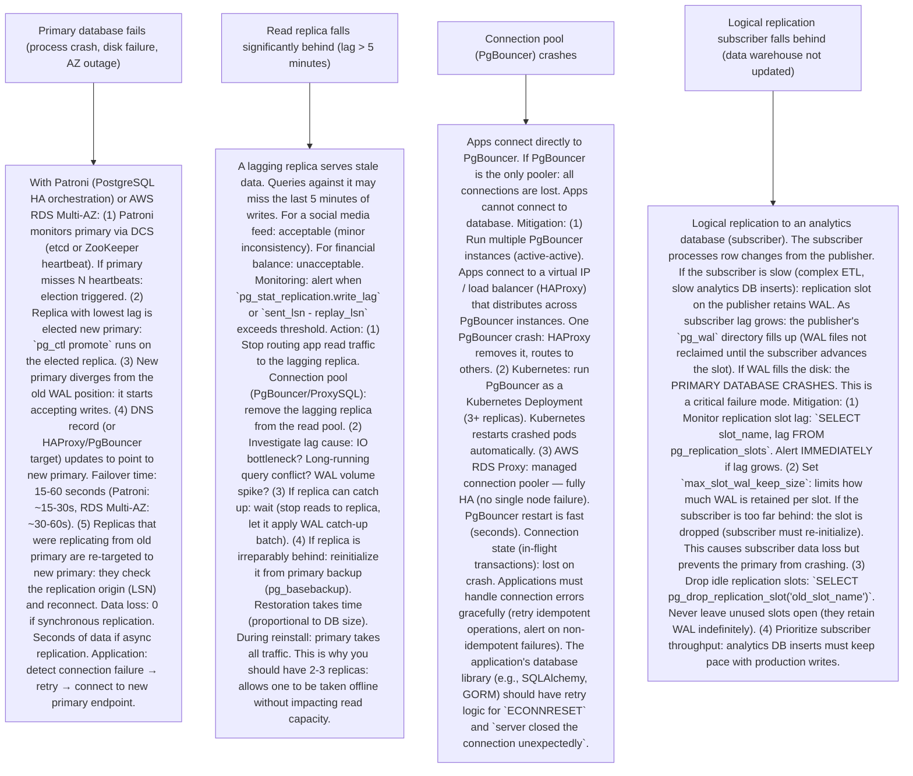

# P9 — Read Replicas & WAL (like PostgreSQL, MySQL, AWS RDS, PlanetScale)

---

## ELI5 — What Is This?

> Imagine a doctor's office with 1 doctor and 1000 patients.
> The doctor writes prescriptions (writes/updates) — only she can do that (the primary).
> But many patients just need to READ the prescription, not change it.
> If every patient goes to the same doctor for a read: she's overwhelmed.
> Solution: make COPIES of all prescriptions and give them to 5 nurses (read replicas).
> Patients can ask any nurse to read their prescription.
> The doctor only handles the few patients who need to actually change something.
> The "WAL" (Write-Ahead Log) is the logbook the doctor uses:
> every prescription is written in the logbook FIRST, then enacted.
> Nurses receive a copy of the doctor's logbook continuously
> and keep their copies up-to-date by applying the same changes.
> This is how PostgreSQL, MySQL, and AWS RDS scale reads:
> one primary for writes, multiple read replicas for reads (fed by the WAL/binlog).
> Used by Instagram, GitHub, Shopify, Airbnb, and virtually every production web application.

---

## Glossary (Every Keyword Explained in ELI5)

| Word | ELI5 Meaning |
|---|---|
| **Primary (Master)** | The database node that accepts all writes (INSERT, UPDATE, DELETE). The single source of truth. All data changes originate here. In PostgreSQL: the "primary server." In MySQL: the "source" (previously: master). |
| **Read Replica (Standby / Secondary)** | A database node that receives and applies a copy of all writes from the primary (via WAL/binlog streaming). Accepts read queries (SELECT). Does NOT accept writes (in PostgreSQL: read-only mode enforced). Reduces load on the primary by offloading read traffic. |
| **WAL (Write-Ahead Log)** | PostgreSQL's durability mechanism. Every data modification is written to the WAL (a sequential append-only log) BEFORE the actual data pages are modified. If the database crashes: the WAL is used to replay missing changes on restart. The WAL is also the mechanism for replication: standby servers receive and apply the WAL stream from the primary. |
| **Binlog (Binary Log)** | MySQL/MariaDB equivalent of the WAL. A sequential log of all data-changing SQL statements (statement-based binlog) or row changes (row-based binlog). Used for both point-in-time recovery and replication to read replicas. |
| **Physical Replication** | Replication that streams raw WAL bytes (block-level changes) from primary to replicas. The replica applies the exact same byte changes. Fast, efficient. The replica must run the SAME PostgreSQL major version as the primary. Used for streaming replication in PostgreSQL. |
| **Logical Replication** | Replication that streams logical changes (row-level: INSERT/UPDATE/DELETE with column values) rather than raw blocks. Platform-independent (can replicate to a different PostgreSQL major version, or even to a different database type). Used for: database upgrades, selective table replication, cross-datacenter replication. PostgreSQL logical replication uses "publication" + "subscription" model. |
| **Replication Lag** | The delay between when a write is committed on the primary and when the same change is visible on a replica. Typically: 10ms–100ms under normal load. Under heavy load (the replica can't keep up with the WAL stream): lag can grow to seconds or minutes. If a user writes and then immediately reads from a replica: they might see stale data (the write hasn't propagated yet). |
| **Synchronous Replication** | The primary waits for at least one replica to confirm it has received AND written the WAL before acknowledging the write to the client. Guarantees zero data loss on primary failure. Penalty: write latency increases (must wait for replica confirmation across network). PostgreSQL: `synchronous_standby_names`. |
| **Asynchronous Replication** | The primary acknowledges the write to the client immediately, then streams the WAL to replicas in the background. Low write latency. Risk: if the primary fails before the replica receives the latest WAL: some committed transactions are lost during failover (RPO > 0 seconds). Default mode for most production PostgreSQL deployments. |
| **Read-Your-Writes Consistency** | After a user writes data: their next read MUST see that write. If reads go to a replica with replication lag: the user might not see their own write. "I just posted a comment — why can't I see it?" Solution: route a user's reads to the primary (or a low-lag replica) immediately after they write. |
| **Hot Standby** | A PostgreSQL read replica that's fully operational for read queries while also continuously applying WAL. (Contrast: a "warm standby" that applies WAL but doesn't serve reads until promoted to primary.) Hot standbys are the standard for read scaling. |
| **Cascading Replication** | A replica can itself have replicas (replica's replica). Primary → Replica 1 → Replica 2 → Replica 3. Reduces WAL streaming load on the primary (primary only streams to Replica 1; Replica 1 distributes to 2, 3). Used in very large-scale deployments (GitHub, Shopify). |

---

## Component Diagram



---

## Step-by-Step Request Flow

```mermaid
sequenceDiagram
    participant App
    participant PgBouncer as PgBouncer (connection pooler)
    participant Primary as PostgreSQL Primary
    participant WALStream as WAL Receiver (on Replica)
    participant Replica1 as Read Replica 1
    participant Replica2 as Read Replica 2 (async)

    Note over App,Replica2: === WRITE PATH ===
    App->>PgBouncer: BEGIN; INSERT INTO orders ...; COMMIT; (write connection)
    PgBouncer->>Primary: Route to primary
    Primary->>Primary: 1. Write transaction to WAL (LSNXXXX)
    Primary->>Primary: 2. Apply changes to data pages (in-memory buffer)
    Primary->>Primary: 3. Flush WAL to disk (if synchronous_commit = on)
    Primary->>WALStream: 4. Stream WAL record (LSN XXXX) to Replica 1 (synchronous standby)
    WALStream->>Replica1: Write WAL record to replica's WAL receive buffer
    Replica1-->>Primary: WAL ACK (confirmed write to replica's WAL)
    Primary-->>App: COMMIT OK (after replica WAL ACK for synchronous replication)
    Note over Replica1: Replica 1 applies WAL: INSERT into its local data pages (~10ms after ACK)
    Replica2->>Primary: Poll WAL (async): "give me WAL after my last received LSN"
    Primary-->>Replica2: WAL records (lag: depends on Replica 2's apply rate)

    Note over App,Replica2: === READ PATH (load balanced) ===
    App->>PgBouncer: SELECT * FROM products WHERE product_id=456 (read query)
    PgBouncer->>PgBouncer: Route to read replica (round-robin: Replica 1 or Replica 2)
    PgBouncer->>Replica1: Forward read query
    Replica1->>Replica1: Execute query on local data pages
    Replica1-->>App: Result set: {product_id: 456, name: "Widget"}

    Note over App,Replica2: === READ-YOUR-WRITES SCENARIO ===
    App->>Primary: UPDATE users SET name='Alice' WHERE id=1 (write)
    Primary-->>App: COMMIT OK
    App->>App: Store: user_id=1, wrote_at=now(), sticky_to_primary=true (5 second window)
    App->>PgBouncer: SELECT name FROM users WHERE id=1 (immediate read after write)
    PgBouncer->>PgBouncer: Check sticky_to_primary: user_id=1 → yes, within 5s window
    PgBouncer->>Primary: Route to primary (not replica — avoids lag inconsistency)
    Primary-->>App: {name: "Alice"} (fresh data, no replication lag)
    Note over App: After 5 seconds: reads resume routing to replicas

    Note over App,Replica2: === FAILOVER ===
    Note over Primary: Primary crashes (disk failure)
    Replica1->>Replica1: Replica 1 detects no new WAL within timeout (10s)
    Replica1->>Replica1: Promoted to primary via pg_ctl promote / Patroni / RDS automation
    App->>App: DNS update: primary.db.internal → Replica 1's new IP (TTL: 30s)
    App->>Replica1: Connect to new primary
    Note over Replica2: Replica 2 now replicates from new primary (Replica 1). Cascading replication updated.
```

---

## Bottlenecks — Every Point Explained

| # | Bottleneck | Why It Hurts | Fix |
|---|---|---|---|
| 1 | **Replication lag under heavy write load** | If the primary receives writes faster than the replica can apply them: the replica falls behind. At high write rates (50K UPS/second with complex updates): the WAL stream may exceed the replica's ability to apply changes, especially if the replica has slow I/O or is running complex indexes. Queries against the lagging replica return stale data. Under extreme lag (minutes): the replica's query results can be wildly outdated. | Monitor replication lag: `SELECT pg_current_wal_lsn() - pg_last_wal_receive_lsn()` or use `pg_stat_replication` view. Alert when lag > threshold. For heavy write loads: replicas need matching or better I/O performance to primary (don't use slower disk for replicas). Use fewer read replicas per primary (less total WAL streaming overhead). Partitioning: a separate pre-aggregation layer (materialized views, summary tables) reduces query load on replicas. Logical replication to dedicated analytics database: allows read replicas to serve transactional reads while analytics queries hit the separate analytics DB. |
| 2 | **Connection storms overwhelming the primary** | Each active PostgreSQL connection consumes a process (~5-10 MB RAM). At 1000 concurrent connections: 5-10 GB RAM used just for connection overhead. Beyond 300-500 connections: primary performance degrades. At login storms (Black Friday, 9 AM Monday): thousands of app servers open connections simultaneously. Primary becomes connection-bound, not query-bound. | PgBouncer (connection pooler): app servers connect to PgBouncer, not directly to PostgreSQL. PgBouncer maintains a small pool of actual PostgreSQL connections (e.g., 100 connections, pooling for 10,000 app threads). `transaction` mode: a PostgreSQL connection is held only for the duration of each transaction (not per app thread). Pool size: primary pool = 100 connections. Replica pool = 100 connections each. Apps report 10K concurrent users → PgBouncer handles connection multiplexing. PgBouncer is a single process: also deploy multiple PgBouncer instances (active-active) for HA. RDS Proxy (AWS): managed connection pooling for RDS, integrates with IAM auth and Secret Manager. |
| 3 | **Replica promotion causes data loss (async replication)** | Default: async replication. Primary ships WAL to replicas asynchronously. Primary acknowledges writes to clients BEFORE the replica confirms receipt. If the primary crashes after acknowledging a write but before the replica receives that WAL segment: the write is committed (client saw OK) but the replica never received it. When the replica is promoted to new primary: those transactions are permanently lost (up to several seconds of RPO). | Synchronous replication for critical data: `synchronous_standby_names = 'replica1'`. Primary waits for at least one replica's WAL ACK before confirming to client. Write latency increases by ~2× (extra network round trip). But RPO = 0: no committed transactions are lost. Quorum-based sync: `synchronous_standby_names = 'ANY 1 (replica1, replica2, replica3)'`. Write is confirmed when ANY 1 of the 3 replicas ACKs. More availability than strict sync (1 replica can be down). AWS RDS Multi-AZ: synchronous replication to standby in a different AZ. Automatic failover in < 60 seconds with 0 data loss. Standard for production financial data. |
| 4 | **Read-your-writes violations** | App writes data on primary. Immediately reads from replica. Replica hasn't applied the write yet (lag 50ms). User sees stale data. Common scenario: user updates profile picture → page refreshes → old picture is shown (replica lag). Amazon's shopping cart: user adds item → refreshes → item missing. Confuses and frustrates users even though the data is safe. | Track writes per session: after every write, set a session variable `last_write_ts = now()`. On next read: if `now() - last_write_ts < lag_threshold (e.g., 500ms)`: route to primary. After threshold: route to replica. ProxySQL / PgBouncer routing: detect writes in the ORM layer or connection proxy. Route reads to primary for users within a post-write window. Wait-for-sync on critical reads: after important writes (checkout), query a replica's current LSN: `SELECT pg_last_wal_replay_lsn()`. Wait until replica's LSN ≥ primary write LSN. This guarantees the replica has applied the specific write before reading from it (bounded wait, typically < 200ms). |
| 5 | **Long-running queries on replicas block WAL application** | PostgreSQL's Hot Standby conflict resolution: if a long-running query is running on a replica AND the WAL stream needs to vacuum (reclaim) a row that the query is currently reading → conflict. PostgreSQL must cancel the long query on the replica OR delay applying that WAL record. `max_standby_streaming_delay` (default: 30 seconds): the replica delays WAL application for up to 30s for conflicting queries. During this delay: replication lag grows. If a long query runs > 30s: PostgreSQL cancels it with "error: canceling statement due to conflict with recovery." | Increase `max_standby_streaming_delay`: allow more time for queries. But this allows lag to grow up to the delay. Better: use `recovery_min_apply_delay` for TESTING replicas only. For production read replicas: keep queries short. Offload long-running analytics to a dedicated analytics replica (or data warehouse) with `hot_standby_feedback = on` (tells the primary not to vacuum rows needed by active replica queries). Temporal tables / historical snapshots: maintain a read-only snapshot of data at a consistent point in time for analytics, avoiding conflict with live WAL application. |

---

## What Happens When Each Part Fails?



---

## Key Numbers to Know

| Metric | Value |
|---|---|
| Typical async replication lag (same AZ) | 5–50ms |
| Typical async replication lag (cross-region) | 100ms–1s |
| Synchronous replication write latency overhead | ~same-AZ RTT (2–5ms same DC, 50–200ms cross-region) |
| PostgreSQL max connections (recommended) | 200–500 (above = use PgBouncer) |
| PgBouncer max frontend connections | 10,000+ (lightweight proxy) |
| AWS RDS Multi-AZ automatic failover time | 30–60 seconds |
| Patroni failover time | 15–30 seconds |
| pg_basebackup (full DB copy for new replica) | Proportional to DB size (~100 GB/hour on fast network) |
| WAL segment size (default) | 16 MB per segment |
| pg_replication_slots WAL retention | Indefinite until slot advances (DANGER!) |

---

## How All Components Work Together (The Full Story)

The combination of WAL-based replication and read replicas is the **foundational scaling pattern for relational databases**. Virtually every production web application uses it.

**The WAL: the backbone of reliability and replication:**
PostgreSQL's WAL is a sequential append-only log. Every committed transaction is written here first. This provides crash recovery: on restart, PostgreSQL replays the WAL to recover the last few seconds of changes. But the WAL also enables replication: any server that receives the WAL can replay it and maintain an identical copy of the data. This is PostgreSQL physical replication.

**The read scaling model:**
Typical web applications have a 90:10 or 80:20 read:write ratio. If 90% of traffic is reads: a read replica can handle that 90%, leaving the primary free to handle only the 10% writes. With 5 read replicas: the read capacity is 5× the primary, all at the cost of some replication lag and added infrastructure.

**The connection model:**
Apps don't connect directly to PostgreSQL (too many connections = memory exhaustion). PgBouncer pools connections: thousands of app threads share tens of PostgreSQL connections. This is essential at scale. The pooler also handles replica selection (routing reads to replicas, writes to primary).

**Failover and HA:**
Patroni (or AWS RDS Multi-AZ, Google Cloud SQL HA): monitors the primary, orchestrates failovers. The key: the primary must be declared dead before a replica is promoted. If both the primary AND the old replica consider themselves primary = split-brain. Patroni uses a Distributed Consensus Store (etcd) to ensure only one leader exists (fencing/STONITH: a promoted replica must confirm the old primary is unreachable before accepting writes).

> **ELI5 Summary:** Think of the primary DB as a bank vault manager who records every transaction (WAL). Several bank clerks (replicas) receive a copy of the manager's log and update their own ledgers in real-time. Customers (reads) can ask any clerk for account details — but only the manager can actually change accounts. If the manager gets sick: the most up-to-date clerk is promoted to manager. The WAL log ensures no transaction is lost and every clerk stays in sync.

---

## Key Trade-offs

| Decision | Option A | Option B | Why |
|---|---|---|---|
| **Synchronous vs asynchronous replication** | Synchronous: zero data loss (RPO=0). Write latency is doubled (wait for replica ACK). One replica failure blocks writes if all sync standbys are down (unless using quorum). | Asynchronous: low write latency (no replica ACK wait). Risk: up to N seconds of data loss on primary failure (RPO > 0). Higher write throughput. | **Use synchronous replication for critical data**: financial transactions, user authentication, healthcare records. **Use async replication for everything else**: product catalog, user activity, session data. Hybrid: `synchronous_commit = remote_write` (replica writes WAL to disk but doesn't apply yet — lower latency than waiting for full ACK, higher durability than pure async). AWS RDS Multi-AZ: synchronous by default for the standby replica. |
| **Physical replication vs logical replication** | Physical: exact block-level copy. Fast, efficient. Must match PostgreSQL major version. Cannot replicate individual tables. One-way (primary → replica only). Cannot apply transforms. | Logical: row-level changes (INSERT/UPDATE/DELETE). Flexible: replicate selected tables, to different versions, to different databases. Bidirectional replication possible. Slightly higher overhead than physical. | **Physical replication for primary HA standby replicas** (fast, exact, supports all data types). **Logical replication for specific use cases**: zero-downtime database version upgrades (replicate from v14 to v15 side-by-side), selective sync to analytics DB, multi-master setups (BDR, Citus), CDC for microservices (Debezium reads logical replication output). |
| **Managed DB (RDS, Cloud SQL) vs self-managed PostgreSQL** | Managed: handles failover, backups, patching, storage auto-scaling. Less operational complexity. Cost: 2-3× more expensive per GB vs self-managed. Less configuration control. Limited extensions. | Self-managed: full control (any extension, any OS tuning, custom WAL configuration). Lower cost at scale. High operational complexity (DBA required for failover, backups, patching, monitoring). | **Start with managed (RDS/Cloud SQL)** for startups and small teams (they save hundreds of engineer-hours per year). Switch to self-managed at scale (> 500 GB databases, latency requirements below managed DB constraints, cost > $10K/month). GitHub runs self-managed MySQL (Vitess-based) at their scale. Shopify runs self-managed MySQL. Netflix runs self-managed Cassandra. But Instagram started on AWS RDS and iterated. |

---

## Important Cross Questions

**Q1. Explain the PostgreSQL WAL and how it enables both crash recovery and replication.**
> The WAL (Write-Ahead Log) is a sequential, append-only file that records every data modification before it's applied to the actual data pages. "Write-ahead" means: the WAL record is written and flushed to disk FIRST. Then the data pages are modified (in memory, flushed later by the background writer). Why crash recovery works: if PostgreSQL crashes mid-operation, the data pages may be partial. On restart: PostgreSQL reads the WAL from the last checkpoint and replays all changes the WAL recorded but the data pages weren't guaranteed to reflect. Result: data is brought to the last committed state. Why replication works: the WAL is a complete, replay-able record of every change. Send that WAL stream to another PostgreSQL instance: it applies the exact same changes and maintains an exact copy of the primary's data. Physical standby servers receive the WAL stream via `pg_receivewal` or via a streaming replication connection. They apply WAL records continuously. Result: an always-current copy of the primary that can serve reads (hot standby) and can be promoted to primary in seconds if the primary fails.

**Q2. What is replication lag and how do you mitigate "read-your-writes" violations?**
> Replication lag: the time elapsed between when a change is committed on the primary and when the same change is visible on a replica. Causes: network latency (primary and replica in different AZs or regions), slow replica I/O (replica can't apply WAL as fast as primary generates it), long-running transactions blocking the replica's WAL apply process. Measurement: `pg_stat_replication.replay_lag` (primary perspective) or `pg_last_wal_replay_lsn()` vs `pg_current_wal_lsn()` in the app. Read-your-writes: a user writes data (primary) then reads (replica). If the replica hasn't applied the write yet (lag 100ms): the read returns stale data. The user sees their own write disappear. Mitigation strategies: (1) Track user write timestamps: route reads to primary for N seconds after a write. (2) LSN-based check: after a write, note the primary's current LSN. Before a replica read, verify the replica's replay LSN ≥ write LSN. Wait (briefly) if replica is behind. (3) Session-level primary affinity: for critical flows (checkout, profile update), always read from primary. (4) Sticky sessions: a load balancer that routes the same user to the same replica for a session (but doesn't help if the replica is behind).

**Q3. How does AWS RDS Multi-AZ differ from Read Replicas?**
> RDS Multi-AZ (High Availability): synchronous replication from the primary RDS instance to a standby in a different AZ. The standby is NOT accessible for reads (it's only for failover). Purpose: data durability and automatic failover on primary failure (30-60 second RTO, RPO = 0). You pay for 2 instances but only use 1. RDS Read Replicas: asynchronous replication from the primary to read-only replicas. Read replicas ARE accessible for SELECT queries. Purpose: read scaling. You pay per read replica and split read traffic across them. Can be in different AWS regions (cross-region read replicas). Lag: async = seconds. NOT for HA failover (would have some data loss). Combination: start with Multi-AZ (HA). Add read replicas as read traffic grows. Each read replica also automatically has HA within its own AZ (runs on Multi-AZ storage). Read replicas can be promoted to standalone databases (or as disaster recovery in another region). RDS Aurora: different architecture. Uses a single shared distributed storage layer replicated 6 ways across 3 AZs. All Aurora replicas read from the same storage (no replication lag for reads). Replicas can be promoted in < 30 seconds.

**Q4. What is the "split-brain" problem in PostgreSQL HA and how does Patroni solve it?**
> Split-brain: two database instances simultaneously believe they are the primary and accept writes. This creates conflicting writes that can't be reconciled. Scenario: (1) Primary A and Replica B are in different AZs. (2) A network partition occurs. Replica B can't reach Primary A. (3) Watchdog (on Replica B's side) thinks Primary A is dead and promotes Replica B to primary. (4) Network heals. Now both A and B think they're primary. Both have accepted writes. Data is split — irreconcilable. Patroni's solution: (1) Uses a distributed consensus store (etcd, ZooKeeper, or Consul) as the "leader lock." Only one node can hold the leader lock at a time. (2) Primary A must renew the leader lock every N seconds (TTL: e.g., 30 seconds). (3) If Primary A fails to renew the lock (network partition, crash): the lock expires. (4) Replicas compete to acquire the lock. The winner (best-positioned replica — highest LSN) acquires the lock and promotes itself. (5) Old Primary A, when it reconnects, tries to renew the lock — finds it gone → demotes itself (stops accepting writes, becomes a replica). Result: at most one node holds the lock → only one primary. Split-brain is impossible as long as the consensus store is healthy.

**Q5. What is PgBouncer and why is it essential for PostgreSQL at scale?**
> PostgreSQL creates a new OS process for every client connection. Each process uses ~5-10 MB of RAM. At 500 connections: 2.5-5 GB used just for connection overhead. Beyond 300-500 connections: PostgreSQL starts thrashing context switches between processes. Queries slow down even if the database itself isn't busy. Node.js apps: each request handler opens a database connection → thousands of concurrent connections during peak traffic. Rails (Puma with 16 threads × 20 workers = 320 db connections per server × 10 servers = 3200 connections total). PgBouncer solves this by being a connection multiplexer: App connects to PgBouncer on port 5432 (same as PostgreSQL). PgBouncer maintains a small pool of actual PostgreSQL connections (e.g., 100). When an app query arrives: PgBouncer borrows a PostgreSQL connection from the pool, executes the query, returns the connection to the pool immediately (in `transaction` mode). 10,000 app threads can share 100 PostgreSQL connections (100× connection reduction). PgBouncer modes: `session` (one PostgreSQL connection for entire session — minimal advantage), `transaction` (pool connection per transaction — standard production mode), `statement` (pool connection per statement — only for autocommit queries).

**Q6. How does logical replication enable zero-downtime PostgreSQL major version upgrades?**
> PostgreSQL major version upgrades (e.g., v13 → v16) require all connections to be dropped and the database to be in single-user mode for `pg_upgrade`. On large databases (10TB): `pg_upgrade` takes hours. Zero-downtime approach using logical replication: (1) Provision a new PostgreSQL v16 server. (2) On v13 primary: create a PUBLICATION for all tables. (3) On v16 server: create a SUBSCRIPTION to the v13 primary's publication. (4) Initial data sync: v16 copies all existing rows from v13 (via COPY). This takes hours for large databases but the v13 primary remains fully operational. (5) Change replication: after initial sync, the v16 server applies ongoing changes (INSERT/UPDATE/DELETE) from v13's WAL in near-real-time. Lag: typically < 1 second. (6) Pre-upgrade test: run application read queries against v16 replica. Verify data consistency. (7) Cutover window (minutes): pause writes to v13. Wait for v16 to catch up to v13's LSN (lag → 0). Update DNS/connection string to v16. v13 becomes stale. (8) Post-cutover: remove subscription on v16. v16 is now the primary. Total downtime: the cutover window (minutes), not hours. Prerequisite: all tables must have a primary key (logical replication requires a primary key for UPDATE/DELETE operations to track row identity across versions).

---

## Real-World Apps That Use This Pattern

| Company | Product | How They Use It |
|---|---|---|
| **Instagram** | Social Media Platform | Instagram (at scale) ran PostgreSQL as their primary database. Used read replicas extensively to serve the read-heavy feed and profile queries. Instagram engineering blog documented their PostgreSQL scaling journey. They ran hundreds of read replicas per shard, offloading ~90% of traffic from primaries. Eventually migrated to a custom Django + PostgreSQL multi-shard setup at Facebook scale. |
| **GitHub** | Developer Platform | GitHub runs MySQL (not PostgreSQL) with Vitess for sharding. But the read replica pattern is identical: primary MySQL for writes, multiple read replicas. GitHub Engineering blog documented their "MySQL infrastructure" (2018). Key: they run cascading replication (replica → replica's replica) to scale read distribution without overloading the primary. PgBouncer-equivalent: ProxySQL for MySQL connection pooling and routing at GitHub. |
| **Shopify** | E-Commerce Platform | Shopify uses MySQL with read replicas. The Shopify "pods" (large autonomous MySQL cluster per geography or merchant tier) each have a primary + read replicas. PgBouncer-equivalent: Rails ActiveRecord read-replica routing (separate read and write database configs). Shopify engineering documented their primary health checks and failover automation during peak events (Black Friday = 40K orders/minute). |
| **AWS RDS** | Managed Database Service | AWS RDS is the most widely used implementation of the read replica + WAL streaming pattern. RDS Multi-AZ (synchronous standby): used by millions of applications. RDS Read Replicas: up to 15 read replicas per primary in PostgreSQL, 5 for MySQL. Cross-region read replicas for disaster recovery. RDS Aurora: takes the pattern further with shared storage (eliminates replication lag for reads). Used by Airbnb, Pinterest, Duolingo, and thousands of companies. |
| **Patroni / Zalando** | PostgreSQL HA Framework | Patroni (open-sourced by Zalando) is the standard PostgreSQL HA framework. Zalando runs 4000+ PostgreSQL clusters in production using Patroni + etcd. Handles: failover automation, cascading replication, delayed replicas (point-in-time recovery), synchronous-to-asynchronous replica transitions. Used by Gitlab, Zalando, Cloudflare, Okta, and many others. PostgreSQL Operator (kubernetes) extends Patroni for Kubernetes-native HA PostgreSQL deployments. |
